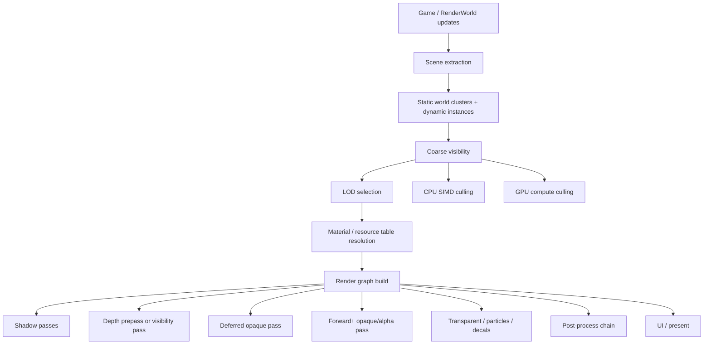
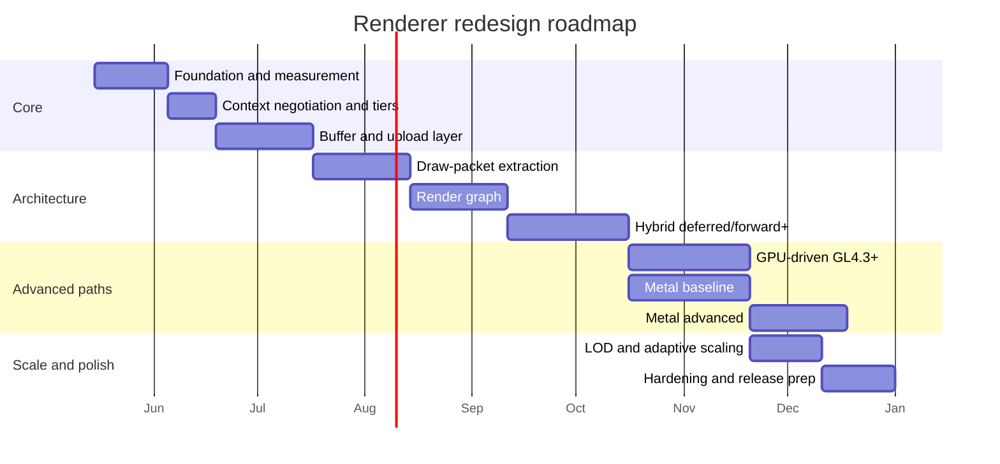

# Reworking OpenQ4 for Extreme Renderer Performance and Tiered GL and Metal Support

## Executive summary

The analysed codebase is the urlthemuffinator/OpenQ4 high-framerate branchhttps://github.com/themuffinator/OpenQ4/tree/high-framerate-rendering-phase4. The most important conclusion is that the renderer redesign should **not** use OpenGL 4.3 as the architectural baseline. In this codebase, the current renderer still creates a generic SDL OpenGL context without explicitly negotiating a modern core profile, and the renderer state and capability model still centre on compatibility-era features such as ARB vertex/fragment programs, ARB2 path validation, compatibility-style extension checks, and an old vertex-cache model. The branch’s own high-framerate work is primarily about **presentation/simulation decoupling, interpolation, and compatibility hardening**, not yet a ground-up renderer rewrite. fileciteturn16file0 fileciteturn19file0 fileciteturn20file0 fileciteturn18file0

The right design is a **tiered renderer** with a **GL 3.3-class modern baseline**, a **GL 2.x compatibility fallback**, a **GL 4.1 macOS-class tier** as requested, a **GL 4.3 “first fully GPU-driven” tier**, a **GL 4.4/4.5 low-overhead tier**, a **GL 4.6-plus/extensions tier**, and a **Metal backend family**. In other words: **4.3 should be the first premium tier, not the minimum tier**. The official OpenGL registry is the correct primary source for the spec and extension ladder; it explicitly tracks the 2.1, 3.3, 4.1, 4.3, 4.4, 4.5, and 4.6 specification lineage and the extension registry used to capability-gate later features. urlofficial OpenGL registryturn0search0 citeturn0search0

Architecturally, OpenQ4 should move to a **data-oriented scene extraction layer**, **draw-packet generation**, **render graph execution**, and **resource-table abstraction**, then choose between **deferred**, **deferred-lite**, and **forward+** depending on tier, bandwidth, and scene characteristics. The original Forward+ paper is still directly relevant because it frames forward clustered/tiled lighting as a way to keep material flexibility while culling light lists before shading, and the clustered-shading paper remains relevant because it shows why 3D clustering reduces wasted lighting work versus screen-space-only binning. urlForward+ paperturn0search3 citeturn0search3turn0search7

For modern systems, the target should be **multi-threaded scene build + GPU-driven visibility + indirect submission + persistent mapped streaming + adaptive frame pacing**. For older or low-power systems, the design must fall back cleanly to **CPU visibility, CPU-built batches, instancing where available, reduced MRT pressure, simplified lighting, and conventional buffer orphan/map streaming**. The repo already contains evidence that OpenQ4 can benefit from careful asynchronous and threaded work: the light-grid baking path uses worker threads and optional pixel-pack-buffer async readback, and the shadow-map documentation already describes explicit fallback to the legacy shadow path when the newer path is unavailable or unsuitable. fileciteturn14file2 fileciteturn14file3

Assumptions used in this report are intentionally conservative. There is no fixed hardware target; the engine must scale from old integrated GPUs and low-power PCs through modern desktops. “GL 4.1” is treated here as the requested macOS OpenGL tier. Bindless textures are treated as **optional accelerants**, not a mandatory baseline. Metal is treated as a first-class backend opportunity, but not as a requirement for the GL renderer path. citeturn0search0turn0search4turn0search6turn0search9

## What the current branch and renderer state imply

The branch documentation shows that recent work has focused on **decoupling presentation from the fixed 60 Hz gameplay cadence**, validating high-refresh presentation targets such as 240 FPS, adding interpolation, and hardening special cases like cinematics, GUI timing, AVI capture, and repeated-state redraw behaviour. That is important groundwork, but it is not yet a renderer architecture overhaul. Any redesign should therefore **preserve and build on that work**, not discard it. fileciteturn18file0

The current renderer and platform layer still behave like a legacy compatibility-era renderer. In the SDL backend, OpenQ4 resets GL attributes and creates a context, but it does **not** negotiate a version/profile ladder such as 4.6 core → 4.5 core → 4.3 core → 4.1 core → 3.3 core → compatibility fallback. In renderer init, OpenQ4 still probes and records features such as ARB vertex/fragment programs, NV register combiners, ATI fragment shaders, compatibility-style multitexture checks, and the ARB2 path. That makes a hard 4.3 baseline mismatched to the present code’s actual structure. fileciteturn16file0 fileciteturn19file0

The current `glconfig_t` also reflects this mixed-era model. It tracks compatibility-era features, ARB2 flags, GLSL availability, multitexture counts, simple path preferences, and renderer-path switches such as `allowARB2Path`, `allowNV20Path`, and `preferSimpleLighting`. A redesign should replace that with a **capability database** that records **functional features** rather than renderer-history branches. fileciteturn17file0 fileciteturn19file0

The current vertex cache is also a strong signal. It still uses a legacy block allocator and `NUM_VERTEX_FRAMES = 2` frame-temp model, with VBO or virtual memory storage and end-of-frame reuse. That is adequate for classic front-end/back-end rendering, but it is the wrong foundation for very high refresh rates, multi-threaded command generation, many more visible instances, and modern indirect submission. The redesign should preserve the API intent while replacing the implementation with ring allocators, persistent mapping where supported, and a downlevel streaming path where not supported. fileciteturn20file0

At the same time, the repo already contains useful modern seeds that the redesign should reuse. The renderer already exposes post-processing, HDR scene-target options, enhanced materials, shadow maps, screen-space effects, light-grid baking workers, and async readback slots. The shadow-map user guide also explicitly documents the principle that featureful paths must fall back to a legacy path rather than silently failing. That philosophy should become a core design rule for the whole renderer. fileciteturn19file0 fileciteturn14file2 fileciteturn14file3

## Tiered capability model and runtime selection

The tier model below is the central recommendation. It is designed so that **one scene system** feeds **multiple execution strategies**. Version numbers are not enough by themselves; runtime must check the exact feature set and choose the highest safe tier. The OpenGL spec lineage and extension registry make that kind of gating the correct approach. citeturn0search0

### Proposed tier model

| Tier | Role | Mandatory working assumptions | Preferred pipeline | Main purpose |
|---|---|---|---|---|
| GL2.x compatibility fallback | Legacy survival path | Compatibility context, VBOs if available, FBOs where stable, no compute, no SSBOs, no MDI | Forward / forward-lite | “Runs almost everywhere” fallback |
| GL3.3 baseline | Real architectural baseline for the new renderer | Core-ish path, VAO/VBO, UBOs, instancing, texture arrays, MRTs, timer queries | Deferred-lite for opaque or CPU-binned forward+ | Lowest truly modern tier |
| GL4.1 tier | Requested macOS-class GL tier | Same as GL3.3 plus 4.x-era improvements, but still **no assumption of compute or SSBOs** | Deferred or CPU/VS/FS-assisted forward+ | High compatibility upper-mid tier |
| GL4.3 tier | First full GPU-driven tier | Compute, SSBOs, multi-draw indirect, texture views, program interface query | Hybrid deferred + forward+ with GPU culling/light binning | First “modern premium” tier |
| GL4.4 / GL4.5 tier | Low-overhead submission tier | `ARB_buffer_storage`, persistent mapping, multi-bind, DSA | Same as 4.3, but with much lower CPU overhead | CPU efficiency and stability tier |
| GL4.6 plus extensions | Top GL tier | `GL_ARB_gl_spirv`, optional bindless, optional indirect-count/advanced extensions | Fully GPU-driven where drivers allow | High-end desktop tier |
| Metal baseline | Modern Apple-native tier | Resource-table abstraction, indirect-capable command model, conventional resource binding | Deferred / forward+ depending device class | Preferred Apple-native backend |
| Metal advanced | Premium Metal tier | Argument buffers, ICBs, GPU culling/ICB encoding | GPU-driven clustered forward+ / deferred hybrid | Highest Apple-native efficiency |

This mapping deliberately treats 4.3 as the first tier where full GPU-driven submission becomes reasonable, because the 4.3-era feature set is where compute-based light culling and SSBO-backed visibility and command generation become practical. The 4.4/4.5 layer is then about **reducing CPU overhead and synchronisation cost**, not rethinking the whole pipeline again. citeturn0search0turn0search3turn0search4turn0search6turn0search9

### Required features by tier

| Feature | GL2.x | GL3.3 | GL4.1 | GL4.3 | GL4.4/4.5 | GL4.6+ | Metal baseline | Metal advanced |
|---|---:|---:|---:|---:|---:|---:|---:|---:|
| Compute shaders | No | No | No | Yes | Yes | Yes | Yes | Yes |
| SSBO-style large GPU scene buffers | No | No | No | Yes | Yes | Yes | Yes | Yes |
| Multi-draw indirect | No | No | Limited / avoid assuming | Yes | Yes | Yes | Indirect equivalent via ICB path | Yes |
| `ARB_buffer_storage` / persistent mapping | No | No | No | Optional extension only | Yes | Yes | N/A | N/A |
| DSA | No | No | No | No | Yes | Yes | N/A | N/A |
| Multi-bind | No | No | No | Optional / untrusted | Yes | Yes | N/A | N/A |
| Texture arrays | Avoid relying on | Yes | Yes | Yes | Yes | Yes | Yes | Yes |
| Texture views | No | No | Avoid assuming | Yes | Yes | Yes | View-like slicing | View-like slicing |
| Bindless / descriptor-table-like resources | No | No | No | Optional only | Optional only | Optional, extension-gated | Argument-buffer analogue | Strong argument-buffer path |
| Indirect command buffers | No | No | No | No | No | No | Optional | Yes |

This table is a **conservative design map** rather than a promise that every driver with a given version string behaves identically. The correct runtime rule is: **check the actual feature, not just the version**. That is especially important for extensions, optional accelerants, and old or brittle desktop drivers. citeturn0search0

### Runtime tier selection pseudocode

```cpp
RendererTier SelectRendererTier(const UserPrefs& prefs, const PlatformInfo& platform) {
    Caps caps = QueryCaps();

    if (platform.metalAvailable && prefs.backend != ForceOpenGL) {
        MetalCaps mc = QueryMetalCaps();
        if (mc.argumentBuffers && mc.indirectCommandBuffers) {
            return RendererTier::MetalAdvanced;
        }
        return RendererTier::MetalBaseline;
    }

    // OpenGL path
    if (!caps.contextCreated) {
        return RendererTier::NullRenderer;
    }

    // Prefer explicit core contexts where possible.
    // Fall back to compatibility only when necessary.
    if (caps.glVersion >= 4.6f &&
        caps.hasCompute &&
        caps.hasSSBO &&
        caps.hasMDI &&
        caps.hasBufferStorage &&
        caps.hasDSA) {
        return RendererTier::GL46Plus;
    }

    if (caps.glVersion >= 4.5f &&
        caps.hasCompute &&
        caps.hasSSBO &&
        caps.hasMDI &&
        caps.hasBufferStorage &&
        caps.hasDSA) {
        return RendererTier::GL45;
    }

    if (caps.glVersion >= 4.3f &&
        caps.hasCompute &&
        caps.hasSSBO &&
        caps.hasMDI &&
        caps.hasTextureView) {
        return RendererTier::GL43;
    }

    if (caps.glVersion >= 4.1f &&
        caps.hasUBO &&
        caps.hasInstancing &&
        caps.hasTextureArrays &&
        caps.hasMRT) {
        return RendererTier::GL41;
    }

    if (caps.glVersion >= 3.3f &&
        caps.hasUBO &&
        caps.hasInstancing &&
        caps.hasTextureArrays &&
        caps.hasMRT) {
        return RendererTier::GL33;
    }

    return RendererTier::GL2Compat;
}
```

The executor should then derive **feature flags** from the chosen tier and from individual extensions. For example, the GL4.6 tier can still disable bindless if the extension path is unstable, and a GL4.3 driver can still be routed to CPU culling if compute is reliable but indirect submission is not. That separation between **tier** and **feature bits** is what gives the design robustness. citeturn0search0

### Context creation ladder

The SDL/GL platform layer should be rewritten around an explicit negotiation ladder:

1. Try 4.6 core.
2. Try 4.5 core.
3. Try 4.3 core.
4. Try 4.1 core.
5. Try 3.3 core.
6. If all fail, try compatibility fallback.
7. If on Apple-class platforms and Metal is preferred/available, allow Metal-first selection.

That is a direct response to the current platform code, which creates a context without an explicit version/profile ladder, and to the current renderer init, which still assumes a compatibility-flavoured capability set. fileciteturn16file0 fileciteturn19file0

## Target renderer architecture

The redesign should preserve OpenQ4’s game-facing renderer API, but internally replace the monolithic back-end with five clear layers: **scene extraction**, **visibility and LOD**, **resource tables**, **render graph**, and **backend execution**. The result is one renderer that scales from old GL compatibility machines to modern GPU-driven GL and Metal devices. fileciteturn17file0 fileciteturn19file0

### Recommended architecture



### Scene extraction and draw packets

The current OpenQ4 front-end should stop “thinking in GL calls” and start emitting **draw packets**. A draw packet should contain immutable references to geometry, material ID, per-pass flags, instance data offsets, and sort keys, but **no direct OpenGL state calls**. That allows worker threads to prepare large portions of the frame without touching the GL context, which is crucial because OpenGL submission still has a single-thread choke point on most drivers. The existing decoupled presentation work in the branch already proves that OpenQ4 benefits from separating timing domains; the same principle should be applied to renderer job structure. fileciteturn18file0 fileciteturn19file0

### Visibility, world clustering, and LOD

The engine already has portal, area, scissor, and interaction-culling concepts. Those should become the **coarse visibility layer** rather than being bypassed. For the static world, map geometry should be prebuilt into **clusters** keyed by area, material family, shadow relevance, and depth-only availability. For dynamic models, the renderer should build an instance list per model/material variant. Then LOD should operate on three levels:

1. **Geometry LOD** for models and expensive dynamic meshes.
2. **Cluster/HLOD** for distant world groups where fidelity loss is acceptable.
3. **Shading LOD** for materials, shadows, and lighting features.

This is where the hybrid pipeline gets its scalability: a low-power GL3.3 machine can CPU-cull a smaller set of clusters and render them with reduced shading, while a GL4.3+ or Metal advanced path can GPU-cull much finer cluster granularity and continue to scale up scene density. The original Forward+ and clustered-shading work support this direction because both are about reducing light/shading work by using structured visibility/binning before final shading. fileciteturn19file0 citeturn0search3turn0search7

### Hybrid deferred and forward+ pipeline

The renderer should not choose one universal pipeline. It should choose per tier and per material class:

- **Opaque bulk geometry**: deferred on bandwidth-friendly tiers, deferred-lite on mid tiers, forward+ on lower-end or transparency-heavy scenes.
- **Alpha-tested geometry**: typically forward+ or depth-prepass-plus-forward.
- **True translucency, particles, beams, most special effects**: forward or forward+ only.
- **View models, subviews, GUI surfaces**: forward path, with explicit pass rules.
- **Fallback path**: simple forward lighting with aggressively pruned light lists.

The rationale is exactly the same as in the Forward+ paper: forward+ preserves material flexibility while still reducing the number of lights each shader invocation must consider. That fits OpenQ4’s legacy material system much better than a “deferred only” rewrite. citeturn0search3

### Resource tables and bindless-style abstraction

Introduce a `ResourceTable` abstraction with three implementations:

- **Classic bind slots** for GL2.x / GL3.3 / GL4.1.
- **Descriptor-like table built from arrays/views** for GL4.3+.
- **Optional bindless handles** on high-end GL where the extension is present and proven stable.
- **Argument-buffer-backed tables** on Metal.

This is one of the biggest cross-tier wins. On classic GL, materials bind textures through stable slots and texture arrays where possible. On Metal advanced, the same logical material record becomes an argument-buffer entry. The official Metal argument-buffer documentation is explicit that argument buffers gather many resources into one shader argument and reduce CPU overhead versus binding them individually. urlMetal argument-buffer documentationturn0search6 citeturn0search6

### Render graph

Add a real **render graph**. OpenQ4 already has multiple off-screen paths, shadow resources, and post-process targets, but they are still managed in a relatively ad hoc style. A frame graph should own:

- pass dependencies,
- transient texture/buffer lifetimes,
- framebuffer aliasing,
- pass enable/disable by tier,
- automatic invalidation and resource reuse.

The practical outcome is not just cleaner code. It is lower VRAM pressure, fewer redundant clears and rebinds, and much better extensibility for future GL/Metal dual execution. fileciteturn19file0

## Optimisation strategy for uncapped framerates and low-end fallbacks

### Uncapped-framerate optimisation path

For modern systems, the redesign should target a pipeline where the CPU prepares *substantially more work* without drowning in driver overhead:

1. **Multi-threaded scene extraction and draw-packet generation**  
   Worker threads build per-view visible instance lists, sort keys, shadow casters, and pass packets. Only the final submitter thread performs GL calls. OpenGL stays context-bound; the workload around it becomes parallel. fileciteturn18file0

2. **Multi-buffered persistent mapped ring buffers**  
   Replace the current two-frame temp-buffer model with per-frame ring buffers for instance data, dynamic vertices, skinning output, light lists, and indirect command payloads. Use persistent mapping and buffer storage on GL4.4/4.5+, and map-range/orphan streaming on lower tiers. This is the single biggest CPU-overhead improvement after culling and batching. The OpenGL registry’s extension ladder is exactly what makes this a tiered feature rather than a baseline assumption. fileciteturn20file0 citeturn0search0

3. **GPU-driven culling and indirect draws on GL4.3+ and Metal advanced**  
   For those tiers, upload bounds and material records once, then let compute cull clusters/instances, compact visibility, and emit indirect draws. On Metal, advanced paths should use argument buffers plus indirect command buffers. The official Metal docs explicitly describe ICBs as reducing CPU overhead by reusing commands, and the GPU-encoding example explicitly shows compute-based culling feeding indirect commands. urlMetal indirect-command-buffer documentationturn0search4 citeturn0search4turn0search5turn0search9

4. **Adaptive quality scaling tied to real frame budgets**  
   The branch’s high-framerate work already added frame pacing diagnostics and presentation caps. Extend that philosophy into renderer-quality control: dynamic shadow resolution/cascade count, SSAO sample count, bloom mip count, volumetric/fog budgets, and optional screen-fraction scaling must respond to **measured frame time**, not just user presets. fileciteturn18file0 fileciteturn19file0

5. **Frame pacing and CPU/GPU load balancing**  
   Keep the current presentation/simulation decoupling, but make the renderer pacing-aware. The engine should track CPU build time, submit time, and GPU completion time, then decide whether to shift cost from GPU to CPU or vice versa. Examples: choose deferred-lite instead of full deferred on bandwidth-bound GPUs; choose CPU culling instead of GPU culling if compute is slower than scalar CPU visibility on a low-end GPU. fileciteturn18file0

6. **Async resource uploads**  
   Create an explicit upload manager. On modern GL, use persistent-mapped staging or PBO upload streams; on older GL, use orphaned pixel unpack buffers or subimage uploads; on Metal, use blit encoders. The repo’s current light-grid baking path already demonstrates that asynchronous readback and worker coordination can be made to work in OpenQ4, so the architectural precedent is there. fileciteturn14file2

### Old and low-power fallback strategy

| Area | GL3.3 path | GL2.x compatibility path |
|---|---|---|
| Visibility | CPU SIMD cluster culling | Portal/area + coarse CPU culling |
| Submission | Instanced batched draws | Material-sorted draws, limited instancing |
| Lighting | Deferred-lite or CPU-binned forward+ | Simplified forward lighting |
| Shadows | Reduced shadow maps / fewer cascades | Legacy shadow path or very low-cost maps |
| Materials | Texture arrays where possible | Traditional binds and aggressive sorting |
| Buffers | Map-range/orphan streaming | Conventional VBO updates or client fallback where unavoidable |
| Post FX | Small curated set | Minimal or disabled |
| Scene density | Geometry/shading LOD | Stronger LOD and culling thresholds |

The guiding rule is that low-end paths should still use the **same scene data**, just with fewer passes, smaller working sets, and simpler execution. That makes the codebase more robust than maintaining two unrelated renderers. OpenQ4’s shadow-map guide already establishes the right behaviour here: if the preferred path fails or is unavailable, fall back to the proven legacy path rather than dropping the effect entirely. fileciteturn14file3

## Shader conversion, permutation control, and hybrid API support

The shader stack needs to be redesigned as a **cross-backend toolchain**, not as a collection of handwritten per-backend source files.

### Recommended shader pipeline

1. **Authoritative shader source** in a constrained modern GLSL dialect.
2. **Offline compile to** entity["software","SPIR-V","shader intermediate representation"] for validation and reflection.
3. **Generate backend targets**:
   - GLSL 330 / 410 / 430 / 450 variants for GL tiers,
   - MSL for Metal via urlSPIRV-Cross-compatible Metal workflow guidance in platform docsturn0search6,
   - optional native GL SPIR-V ingestion only on GL4.6-plus where it is actually available and worthwhile. The official OpenGL registry tracks `GL_ARB_gl_spirv` as part of the later extension ladder. citeturn0search0turn0search6

4. **Offline reflection database** that emits:
   - resource bindings,
   - uniform/UBO/SSBO layouts,
   - texture-array view requirements,
   - permutation feature keys,
   - backend capability constraints.

5. **Permutation cache** driven by:
   - material class,
   - lighting mode,
   - shadow mode,
   - alpha mode,
   - skinning/static,
   - backend tier.

The biggest risk in a multi-tier renderer is **permutation explosion**. The cure is to split features into:
- **compile-time structural differences**,
- **specialisation constants / pipeline constants** where supported,
- **runtime branches** for minor choices.

On older GL tiers, keep the shader family deliberately small. On GL2.x, it is reasonable to keep a separate trimmed legacy family rather than force every new shader through a heroic down-translation path. That trade-off improves stability. citeturn0search0

### Shader-management rules

- One canonical material schema.
- One reflection format.
- One shader cache format.
- Backend-specific emitters, not backend-specific material logic.
- Shader compile in CI for **every** tier target.
- Runtime hot-reload only behind a strict validation layer.

This matters for AI-agent implementation because it sharply limits where code generation is allowed to diverge. It also makes later Metal adoption far cheaper than a direct hand-port of every GL shader. citeturn0search0turn0search6

## Concrete repo refactor map and implementation plan for GPT-5.5 agents

The current files that most clearly anchor the redesign are the renderer init and capability code, the renderer interface, the vertex cache, the back-end code, the render-world/light-grid paths, and the SDL GL bootstrap. Those are the correct first refactor points. fileciteturn17file0 fileciteturn19file0 fileciteturn20file0 fileciteturn16file0 fileciteturn14file2

### Concrete code-level change table

| Existing file/module | Change | Why |
|---|---|---|
| `src/renderer/RenderSystem.h` | Introduce `RenderBackendCaps`, `RendererTier`, `IRenderDevice`, `IUploadManager`, `IShaderLibrary`, `FrameGraphBuilder` interfaces | Replace history-based capability flags with feature-driven backend interfaces |
| `src/renderer/RenderSystem_init.cpp` | Split into `GLCapabilityProbe.cpp`, `RendererTierSelect.cpp`, `RendererBootstrap.cpp` | Separate probing, selection, and boot logic |
| `src/sys/win32/win_sdl3.cpp` | Add explicit context negotiation ladder and optional shared upload context support | Current path creates a generic context; new path must negotiate modern tiers explicitly |
| `src/renderer/VertexCache.*` | Replace with `BufferAllocator.*`, `RingBuffer.*`, `LegacyStreamBuffer.*` | Support persistent mapping on modern tiers and stable streaming fallbacks on old tiers |
| `src/renderer/tr_backend.cpp` | Break into pass executors: `DepthPass`, `ShadowPass`, `OpaquePass`, `ForwardPlusPass`, `TransparentPass`, `PostProcessPass` | Remove giant monolithic submit path |
| `src/renderer/draw_common.cpp` | Move common draw-packet to pass translation logic into `DrawPacketTranslator.*` | Centralise state derivation and per-pass packet formatting |
| `src/renderer/tr_render.cpp` / related draw entry points | Feed render graph instead of directly sequencing passes | Needed for transient resources and tier-dependent pass enablement |
| `src/renderer/RenderWorld.cpp` | Add cluster build, instance extraction, LOD hooks, scene packet generation | Turn world submission into data preparation for multiple execution tiers |
| `src/renderer/RenderWorld_lightgrid.cpp` | Migrate to new async upload/readback task system, keep worker logic but decouple from direct legacy paths | Reuse existing async/threading precedent within modern task graph |
| `src/renderer/tr_local.h` | Mark as legacy bridge; progressively move structs into smaller headers (`RendererCaps.h`, `ScenePackets.h`, `PassTypes.h`) | Reduce monolithic global-header coupling |
| `src/renderer/RenderSystem.cpp` | Move render-texture lifecycle into render-graph resource manager | Safer transient and persistent resource ownership |
| Shader sources and program loaders | Replace per-program ad hoc logic with `ShaderLibrary`, `ShaderReflection`, `PermutationKey`, `PipelineCache` | Critical for GL/Metal dual support |
| New `src/renderer/backend/opengl/*` | Add GL device, state cache, command submitter, feature specialisations | Backend isolation |
| New `src/renderer/backend/metal/*` | Add Metal device, resource table mapper, argument-buffer and ICB paths | Future-facing Apple-native backend |
| New `src/renderer/visibility/*` | Add CPU culling, GPU culling, occlusion feedback, cluster metadata | Core scalability subsystem |
| New `src/renderer/material/*` | Add canonical material records and resource-table compilation | Needed for bindless/argument-buffer-like abstraction |
| New `src/renderer/framegraph/*` | Add pass graph, resource aliasing, transient allocation | Modern pass management |
| New `src/renderer/metrics/*` | Add frame timers, counters, pacing telemetry, benchmark capture | Required for agent-safe optimisation work |

### Milestones for GPT-5.5 AI agents

| Milestone | Deliverable | Complexity | Key tasks | Tests and CI checks |
|---|---|---:|---|---|
| Foundation and measurement | Capability DB + renderer telemetry | Medium | Replace scattered capability flags, add tier selection, add pass/frame metrics | Unit tests for tier selection; build smoke tests for GL fallback selection |
| Platform bootstrap | Explicit GL context ladder | Medium | 4.6→4.5→4.3→4.1→3.3→compat fallback; user override flags | Startup smoke on Windows/Linux; regression tests for fullscreen/windowed init |
| Buffer and upload layer | New ring allocators and upload manager | High | Persistent mapped path, map-range/orphan fallback, async upload scheduling | Allocator unit tests; stress upload tests; leak and overrun checks |
| Scene extraction | Draw-packet system | High | Extract world and dynamic instances into backend-neutral packets | Golden-image smoke scenes; packet count and sort-key determinism tests |
| Render graph | Pass graph and transient resource manager | High | Depth/shadow/opaque/transparent/post passes as graph nodes | Resource lifetime tests; image diff tests for core scenes |
| Hybrid pipeline | Deferred-lite + forward+ + fallback forward | High | Opaque path split, transparency rules, pass enablement per tier | Golden-image scenes with transparency, subviews, GUI, particles |
| GPU-driven tier | GL4.3+ culling and indirect submission | Very high | SSBO scene buffers, compute culling, MDI generation | Performance counters; visibility consistency vs CPU reference |
| Metal path | Backend parity skeleton, then advanced path | Very high | Resource tables, baseline executor, then argument buffers + ICBs | Shader translation CI; parity image tests on supported hardware |
| LOD and scaling | Geometry/material/shadow quality scaler | High | LOD heuristics, dynamic budgets, scene-density scaling | Bench scenes with frame-budget assertions and percentile-tracking |
| Hardening and release | Robustness, docs, migration cleanup | Medium | Remove dead paths, docs, compatibility QA, defaults tuning | Full matrix, shader compile matrix, benchmark trend dashboard |

### Suggested milestone timeline



### Agent working rules

For GPT-5.5 agents specifically, enforce these rules:

- One agent family owns **platform/bootstrap**.
- One owns **buffer/upload/resource**.
- One owns **scene extraction and visibility**.
- One owns **shader/toolchain**.
- One owns **render graph and passes**.
- One owns **benchmarks and CI**.
- No agent edits shader ABI, material schema, or packet layout without updating the shared reflection/config artefacts.
- Every optimisation PR must include:
  - before/after counters,
  - no-regression screenshots for reference scenes,
  - one low-tier and one modern-tier validation result.

That keeps the project parallelisable without allowing architectural drift.

## Performance measurement plan, benchmark suite, and limitations

The performance plan should measure **frametime**, not just FPS. The branch’s own pacing work already shows why that matters. The new renderer should report per frame:

- total CPU frame time,
- scene extraction time,
- culling time,
- submit time,
- GPU frame time,
- shadow time,
- opaque time,
- transparency time,
- upload MB/s,
- visible clusters/instances,
- draw count / indirect count,
- VRAM estimate,
- frametime percentiles P50/P95/P99. fileciteturn18file0

### Reference benchmark scenes

Use five scene classes:

1. **Indoor corridor**: many lights, tight portals.
2. **Large outdoor**: long visibility, many shadow casters.
3. **Alpha-heavy / FX-heavy**: foliage, particles, beam effects, BSE stress.
4. **Dynamic-model crowd**: many animated actors and projectiles.
5. **Streaming stress**: rapid movement and resource churn.

Because OpenQ4 already has shadow maps, light-grid baking, subviews, GUI surfaces, and heavy special-effect handling, benchmark content must include those systems instead of only geometry throughput. fileciteturn19file0 fileciteturn14file2 fileciteturn14file3

### Suggested graphs for continuous tracking

- **Stacked frametime bar chart** by subsystem.
- **Frametime percentile line chart** for P50/P95/P99.
- **Visible instances vs frametime** scalability curve.
- **Draw submissions vs frametime** before/after indirect rendering.
- **CPU submit cost** before/after persistent mapping.
- **Tier comparison chart** across GL2.x, GL3.3, GL4.1, GL4.3, GL4.5, GL4.6+, and Metal.
- **Adaptive scaling response graph** showing quality level against frame budget.

### Final recommendation

The renderer redesign should adopt **GL3.3 as the real architectural baseline**, keep a **GL2.x compatibility fallback**, treat **GL4.3 as the first full GPU-driven tier**, use **GL4.4/4.5 for low-overhead submission and persistent mapping**, use **GL4.6-plus/extensions as an opportunistic top end**, and define a **Metal baseline and Metal advanced tier** around argument buffers and indirect command buffers. That gives OpenQ4 one coherent renderer strategy that can push much denser scenes at high refresh rates on modern PCs while still scaling down cleanly on old or low-power systems. citeturn0search0turn0search3turn0search4turn0search6turn0search9

### Open questions and limitations

The main limitation in this research pass is that the branch itself is **not yet a renderer-redesign branch in code**; it mainly documents and validates high-refresh presentation and compatibility work. That is enough to define the redesign direction, but not enough to derive every file-level dependency or all hot spots from direct profiling. The recommended architecture is therefore deliberately conservative, additive, and staged. fileciteturn18file0 fileciteturn18file1