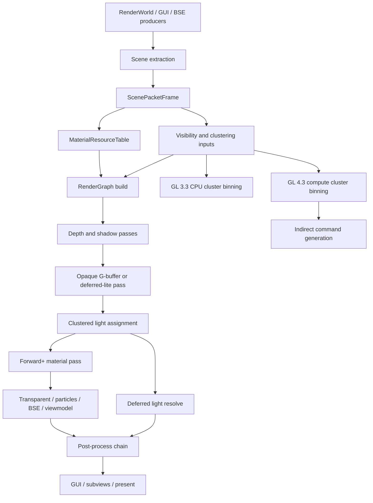

# Clustered Hybrid Deferred/Forward+ GL Renderer Plan

## Purpose

This document is the task plan for turning the current OpenQ4 renderer bridge into a robust, easy-to-debug, high-performance, high-compatibility OpenGL renderer. The target is a clustered hybrid deferred/forward+ pipeline that keeps stock Quake 4 asset behavior intact, preserves the existing ARB2 renderer as a compatibility fallback until parity is proven, and scales from GL 3.3-era hardware through GL 4.6-class desktop drivers.

This plan is GL-only. Metal and Vulkan are out of scope.

## Current Baseline

The active visible renderer is still the legacy ARB2 compatibility path. The modern GL work already provides useful scaffolding:

- Feature-driven GL tier selection and shared context ladders.
- Exact capability probing and token-safe extension parsing.
- Renderer metrics, GPU timer queries, and `gfxInfo` reporting.
- Front-end `ScenePacket`, `DrawPacket`, `PassPacket`, and material-record scaffolding.
- A packet-backed render graph with virtual resources and pass/resource edge accounting.
- `RendererUpload` for static VBO ownership plus dynamic frame-temp upload streams.
- An internal modern GLSL shader library.
- Modern draw and submit plans.
- Opt-in masked GL 3.3 diagnostic submission behind `r_rendererModernSubmit`.
- GL 4.3+ SSBO/compute/indirect validation resources.
- GL 4.5+ DSA and multi-bind validation paths.
- A safe automated validation runner in `tools/tests/renderer_validation_matrix.py`.

The next renderer must promote this scaffold into visible pass ownership in small, reversible steps.

## Design Goals

- [ ] Preserve stock Quake 4 asset compatibility and the unified `baseoq4/` layout.
- [ ] Keep `r_renderer arb2` and the legacy ARB2 path available until full parity is proven.
- [ ] Keep GL 3.3 as the modern baseline, GL 2.x compatibility as the survival path, GL 4.3+ as the GPU-driven tier, and GL 4.5+ as the low-overhead tier.
- [ ] Make the renderer observable: every major subsystem must expose counters, debug names, failure reasons, and validation commands.
- [ ] Make failures recoverable: unsupported features must fall back to a lower tier or legacy pass without corrupting output.
- [ ] Keep every milestone shippable: no milestone may require replacement content or break SP/MP startup.
- [ ] Favor simple visible parity first, then performance.
- [ ] Avoid hidden global state in new code. Prefer explicit frame inputs, pass records, resource handles, and state-cache APIs.
- [ ] Use RenderDoc-friendly markers, stable object labels, and clear pass/resource names.

## Non-Goals

- [ ] Do not add Metal, Vulkan, or an abstract multi-API renderer layer in this plan.
- [ ] Do not make GL 4.3 or GL 4.5 the minimum supported modern tier.
- [ ] Do not remove ARB assembly or current material behavior before visual parity is proven.
- [ ] Do not add engine-side replacement materials, shaders, or `q4base` overrides to hide renderer gaps.
- [ ] Do not automate map launches until the known freeze-prone local map startup path is resolved.

## Target Pipeline



The pipeline is hybrid because OpenQ4 materials and effects are not a clean deferred-only workload. The renderer should choose per pass:

- Opaque bulk geometry: deferred-lite or full deferred where material coverage is ready.
- Perforated/alpha-tested geometry: depth-prepass plus forward+ unless a safe G-buffer representation exists.
- Transparent surfaces, particles, beams, BSE, viewmodels, most subviews, and GUI: forward or forward+.
- Legacy-only material/effect cases: ARB2 compatibility pass until modern parity lands.

## Tier Behavior

| Tier | Role | Expected visible pipeline |
|---|---|---|
| `LegacyGL2Compat` | Survival path | Existing ARB2 renderer, current compatibility behavior. |
| `ModernGL33` | Baseline modern renderer | VAO/VBO/UBO path, real render graph resources, CPU clustered forward+/deferred-lite, map-range/subdata uploads. |
| `ModernGL41` | macOS-class modern tier | GL 3.3 path plus higher GLSL, improved MRT/post behavior where reliable, no compute assumption. |
| `GpuDrivenGL43` | First GPU-driven tier | SSBO scene/light/cluster data, compute light binning and culling, indirect command preparation. |
| `LowOverheadGL45` | Low-overhead tier | Persistent mapped streams, DSA object updates, multi-bind, fence-retired ring buffers. |
| `TopGL46` | Top GL tier | GL 4.5 path plus optional GL SPIR-V and bindless experiments, disabled by default until proven. |

## Debuggability Requirements

Every phase must keep these surfaces current:

- [ ] `gfxInfo` shows the selected tier, active visible executor, fallback executor, graph resources, shader library state, upload path, and failure reasons.
- [ ] `r_rendererMetrics 1` gives a concise frame summary.
- [ ] `r_rendererMetrics 2` gives pass/resource/shader/cluster/submit detail without stalling the GPU.
- [ ] `r_rendererGpuTimers 1` samples pass timings non-blockingly where supported.
- [ ] Each new subsystem has at least one console self-test command.
- [ ] RenderDoc captures show named passes, named FBOs/textures/buffers, and scoped debug groups.
- [ ] Fallbacks are explicit in metrics: no silent "modern path off" behavior.
- [ ] Assertions use clear messages and avoid crashing retail/default runs unless continuing would corrupt renderer state.

## Agent Working Model

GPT-5.5 agents should treat this as a staged execution checklist. Agents may work in parallel only when write scopes do not overlap.

- [ ] One agent owns `RendererCaps`, platform context, and tier/fallback policy.
- [ ] One agent owns `RendererUpload`, buffer allocators, fences, and streaming.
- [ ] One agent owns `ScenePackets`, visibility inputs, and packet schema.
- [ ] One agent owns `RenderGraph`, graph resources, pass scheduling, and frame-resource lifetime.
- [ ] One agent owns `ModernGLShaderLibrary`, shader variants, reflection, and shader validation.
- [ ] One agent owns `ModernGLExecutor`, state cache, draw/submit execution, and GL debug labels.
- [ ] One agent owns validation scripts, docs, metrics checks, and RenderDoc procedures.
- [ ] No agent may change packet layout, material resource layout, cluster layout, or shader ABI without updating docs, self-tests, and metrics together.
- [ ] Every implementation phase must compile, install, run the safe renderer validation matrix, and update docs before handoff.

## Phase 0: Baseline Lock And Safety Rails

Goal: make the current bridge impossible to regress silently.

- [ ] Record the current visible executor as `LegacyARB2Visible` in `gfxInfo`.
- [ ] Add a clear `ModernGLVisible` status bit that remains false until a visible pass is promoted.
- [ ] Add metrics fields for visible executor, fallback executor, and per-pass owner.
- [ ] Extend `tools/tests/renderer_validation_matrix.py` to capture visible executor and pass-owner summaries.
- [ ] Add a `rendererVisiblePathSelfTest` command that confirms default visible output is still ARB2.
- [ ] Add docs explaining how to force legacy, GL 3.3, GL 4.3, and GL 4.5 test modes.
- [ ] Ensure all current modern self-tests pass in one startup command.
- [ ] Acceptance: safe validation passes, and forced modern tiers still leave visible output on ARB2 unless a later phase cvar explicitly enables visible modern passes.

## Phase 1: GL State Cache And Debug Object Framework

Goal: centralize modern GL state changes before visible passes depend on them.

- [x] Add `GLStateCache` for program, VAO, VBO, IBO, UBO, SSBO, textures, samplers, blend, depth, stencil, raster, scissor, viewport, color mask, and framebuffer bindings.
- [x] Add explicit cache invalidation hooks when legacy ARB2 code runs.
- [x] Add `GLDebugScope` wrappers for `KHR_debug` groups when available.
- [x] Add object-label helpers for buffers, textures, framebuffers, programs, and VAOs.
- [x] Add metrics for state-cache hits, misses, forced invalidations, and legacy handoff resets.
- [x] Convert the diagnostic modern submit path to use `GLStateCache`.
- [x] Add a state-cache self-test that exercises redundant state changes and legacy invalidation.
- [x] Acceptance: diagnostic submit path emits fewer redundant binds in metrics and still restores state before ARB2.

## Phase 1 Exit

- Completed: Added `GLStateCache.*`, `GLDebugScope.*`, KHR_debug object labels/scopes, legacy handoff invalidation, diagnostic-submit cache routing, and state-cache reporting.
- Cvars added/changed: None.
- Metrics added/changed: `r_rendererMetrics` now reports state-cache hits, misses, per-category misses, forced invalidations, and legacy handoff resets.
- Self-tests added/changed: Added `rendererGLStateCacheSelfTest` and included it in the safe validation matrix.
- Fallback behavior: ARB2 remains the visible renderer; the modern diagnostic path masks writes and invalidates cache state before ARB2 resumes.
- Validation run: `tools\build\meson_setup.ps1 setup --reconfigure builddir .`; `tools\build\meson_setup.ps1 compile -C builddir -- -j1`; `tools\build\meson_setup.ps1 install -C builddir --no-rebuild --skip-subprojects`; `python tools\tests\renderer_validation_matrix.py`; targeted no-map `r_rendererModernSubmit 1` startup.
- Known limitations: No visible modern pass ownership yet; startup GUI packets still produce no submit-ready diagnostic draws in the no-map smoke case.
- Next phase prerequisites: Real graph resource ownership can now rely on centralized modern GL state binding and RenderDoc-friendly labels/scopes.

## Phase 2: Real Render Graph Resource Ownership

Goal: turn virtual graph resources into actual GL-owned resources while keeping ARB2 visible.

- [x] Add `RenderGraphResourceHandle` with stable id, name, type, dimensions, format, sample count, flags, and debug label.
- [x] Add graph-owned transient texture allocation for color, depth, depth-stencil, and post targets.
- [x] Add graph-owned framebuffer creation and validation.
- [x] Add imported resources for back buffer, legacy scene color/depth, and light-grid data.
- [x] Add resource lifetime tracking with first/last pass, alias group, and physical allocation id.
- [x] Add clear, resolve, invalidate, and present metadata to pass execution records.
- [x] Add resource aliasing only after lifetime validation is passing.
- [x] Add graph dump command: pass list, resource list, lifetime ranges, aliases, and FBO completeness.
- [x] Add `rendererRenderGraphResourceSelfTest`.
- [x] Acceptance: graph can allocate and validate resources for depth, scene color, post ping-pong, GUI, and present without changing visible output.

## Phase 2 Exit

- Completed: Added `RenderGraphResources.*` as the graph-owned resource manager with stable handles, imported legacy/back-buffer/light-grid handles, transient texture/FBO allocation for scene depth/color and post targets, lifetime/alias/physical allocation tracking, pass clear/resolve/invalidate/present records, and `rendererRenderGraphResourceDump`.
- Cvars added/changed: None.
- Metrics added/changed: `r_rendererMetrics` now reports graph invalidates plus `graphGL(...)` prepared/available/handle/import/transient/texture/buffer/physical/FBO/lifetime status.
- Self-tests added/changed: Added `rendererRenderGraphResourceSelfTest`; `rendererRenderGraphSelfTest` now validates invalidate metadata; the safe validation matrix runs the resource self-test.
- Fallback behavior: ARB2 remains the visible renderer. The resource owner allocates and validates modern GL textures and FBOs for observation and future ownership, with imported/default-framebuffer resources standing in for current legacy output.
- Validation run: `tools\build\meson_setup.ps1 setup --reconfigure builddir .`; `tools\build\meson_setup.ps1 compile -C builddir -- -j1`; `tools\build\meson_setup.ps1 install -C builddir --no-rebuild --skip-subprojects`; `python tools\tests\renderer_validation_matrix.py`; targeted `rendererRenderGraphResourceSelfTest` and `rendererRenderGraphResourceDump` startup.
- Known limitations: Aliasing is conservative and only reuses compatible non-overlapping lifetimes; the current world graph keeps `sceneColor` and `postA` separate because their lifetimes overlap. No visible modern pass consumes the allocated resources yet.
- Next phase prerequisites: Material records can now reference stable graph resources and imported legacy/back-buffer handles when building the Material Resource Table V1.

## Phase 3: Material Resource Table V1

Goal: stop modern passes from reaching directly through legacy material structures at submit time.

- [x] Define `MaterialResourceTable` with stable per-frame records for material id, material class, blend mode, alpha test, sort group, texture handles, sampler states, shader register ranges, and fallback reason.
- [x] Build table entries from existing `idMaterial` data without changing material parsing.
- [x] Track first bump, diffuse, specular, emissive, GUI, and post-process images where available.
- [x] Add texture/sampler binding descriptors for GL 3.3 classic slots.
- [x] Add optional texture-array/view descriptor fields for GL 4.3+.
- [x] Add optional bindless handle fields, disabled by default.
- [x] Add metrics for material table entries, texture bindings, missing images, unsupported material features, and fallback classes.
- [x] Add self-tests for opaque, perforated, translucent, GUI, post, and missing-texture records.
- [x] Acceptance: draw packets and draw plans can reference material table records by id, and metrics can explain every fallback.

## Phase 3 Exit

- Completed: Added `MaterialResourceTable.*` as the backend-facing material table; per-frame records now carry stable table ids, material ids/names/classes, blend/sort/alpha-test metadata, shader-register ranges, first semantic texture bindings, GL 3.3 classic slots, GL 4.3+ array/view descriptor candidates, disabled bindless fields, and explicit fallback reasons.
- Cvars added/changed: None.
- Metrics added/changed: `r_rendererMetrics` now reports `materialTable(...)` prepared/available/record/texture/class/fallback/missing-image/unsupported-feature/reason counters, and `gfxInfo` reports material table readiness.
- Self-tests added/changed: Added `rendererMaterialResourceTableSelfTest` and `rendererMaterialResourceTableDump`; the safe validation matrix runs the material table self-test; modern draw/submit/executor self-tests now prepare and consume material table ids.
- Fallback behavior: ARB2 remains the visible renderer. Modern draw plans now require a material table record with no recorded material fallback before treating a draw as plan-ready.
- Validation run: `tools\build\meson_setup.ps1 setup --reconfigure builddir .`; `tools\build\meson_setup.ps1 compile -C builddir -- -j1`; `tools\build\meson_setup.ps1 install -C builddir --no-rebuild --skip-subprojects`; `python tools\tests\renderer_validation_matrix.py`; targeted `rendererMaterialResourceTableSelfTest` and `rendererMaterialResourceTableDump` startup.
- Known limitations: The table is descriptive only; visible material execution is still ARB2. Bindless handles are represented but disabled, and texture array/view fields are descriptors for later ownership rather than live image-view allocation.
- Next phase prerequisites: Scene Packet V2 and geometry records can now reference stable material table ids instead of pulling material state from legacy draw surfaces during submit planning.

## Phase 4: Scene Packet V2 And Geometry Records

Goal: make packets backend-neutral enough for visible modern drawing.

- [x] Add `GeometryResourceRecord` for ambient vertex buffer, index buffer, offsets, formats, bounds, skinning mode, deform mode, and upload lifetime.
- [x] Add `InstanceRecord` for model matrix, previous matrix, entity color, shader register base, skinning palette offset, and visibility flags.
- [x] Replace direct submit-time dependence on `drawSurf_t` fields with copied packet/record data where practical.
- [x] Keep legacy pointers only as debug/provenance fields until removed later.
- [x] Add packet categories for subviews, remote camera surfaces, BSE/special effects, viewmodel, and render demos.
- [x] Add overflow behavior that falls back cleanly to ARB2 and reports the overflow cause.
- [x] Add deterministic packet sort-key validation against legacy sort order.
- [x] Add frontend packet tests using representative depth, interaction, GUI, special effect, and post cases.
- [x] Acceptance: the modern draw plan can be built from packet records without dereferencing legacy draw surfaces except for explicitly marked bridge cases.

## Phase 4 Exit

- Completed: Scene packets now carry copied `GeometryResourceRecord` and `InstanceRecord` data, including VBO/IBO handles and offsets, cache byte ranges, vertex/index formats and counts, bounds, skinning/deform/upload classifications, matrices, entity color, shader-register ranges, visibility flags, packet categories, sort-key validation, and overflow cause reporting. Modern draw and submit plans now consume those packet records instead of reaching through `drawSurf_t` at submit time.
- Cvars added/changed: None.
- Metrics added/changed: `r_rendererMetrics` now reports geometry/instance record counts, record references, category counts for world/subview/remote/effects/viewmodel/render-demo/GUI/post/present/command packets, packet sort-key validation failures, and scene-packet overflow cause.
- Self-tests added/changed: Added `rendererGeometryResourceSelfTest`; expanded `rendererScenePacketSelfTest`, `rendererModernGLDrawPlanSelfTest`, `rendererModernGLSubmitPlanSelfTest`, and `rendererModernGLExecutorSelfTest` to require geometry and instance records; the safe validation matrix runs the geometry-resource self-test.
- Fallback behavior: ARB2 remains the visible renderer. Packet or record overflow is explicit in stats and leaves affected modern planning work unavailable rather than corrupting legacy output.
- Validation run: `tools\build\meson_setup.ps1 compile -C builddir -- -j1`; `tools\build\meson_setup.ps1 install -C builddir --no-rebuild --skip-subprojects`; targeted renderer self-test startup with `rendererScenePacketSelfTest`, `rendererGeometryResourceSelfTest`, `rendererModernGLDrawPlanSelfTest`, `rendererModernGLSubmitPlanSelfTest`, and `rendererModernGLExecutorSelfTest`; `python tools\tests\renderer_validation_matrix.py` passed 12/12 automated safe cases.
- Known limitations: The copied records still retain legacy pointers as debug/provenance and upload fallback bridges. Visible pass ownership is still ARB2 until Phase 6+ promotes modern depth/material execution.
- Next phase prerequisites: Shader Library V2 can bind against stable packet material, geometry, and instance records instead of depending on legacy draw-surface state during submit planning.

## Phase 5: Shader Library V2 And Permutation Control

Goal: create the shader foundation for visible passes without exploding permutations.

- [x] Define a compact `PermutationKey` ABI for material class, lighting mode, shadow mode, alpha mode, skinning/deform mode, light-grid mode, fog mode, debug mode, and tier.
- [x] Add built-in GLSL source families for:
  - [x] depth only
  - [x] shadow depth
  - [x] G-buffer opaque
  - [x] G-buffer alpha-tested
  - [x] deferred light resolve
  - [x] clustered forward opaque
  - [x] clustered forward alpha-tested
  - [x] transparent forward
  - [x] GUI
  - [x] post-copy/post-chain
  - [x] debug visualization
- [x] Add reflection records for UBOs, SSBOs, samplers, images, attributes, and uniform locations.
- [x] Add shader compile logs with material/pass/tier/permutation context.
- [x] Add offline or startup validation for GLSL 330, 410, 430, and 450 variants.
- [x] Add runtime shader reload only behind a debug cvar.
- [x] Add `rendererShaderLibrarySelfTest` that compiles all enabled tier variants.
- [x] Acceptance: shader library exposes all pass programs needed for the first visible depth and opaque milestones, with clear fallback for unsupported permutations.

## Phase 5 Exit

- Completed: Shader Library V2 now exposes 14 built-in program families across enabled GLSL 330/410/430/450 tiers: depth, shadow-depth, transitional flat/light-grid/fog/GUI/post families, G-buffer opaque and alpha-tested, deferred light resolve, clustered forward opaque and alpha-tested, transparent forward, and debug visualization. `rendererPermutationKey_t` now carries deform, light-grid, fog, and debug modes in addition to material, lighting, shadow, alpha, skinning, and tier fields; scene material records populate those fields from the legacy material and geometry metadata.
- Cvars added/changed: Added `r_rendererShaderReload`; `rendererShaderLibraryReload` refuses to rebuild unless that debug cvar is enabled.
- Metrics added/changed: `gfxInfo` now reports Shader Library V2 program/kind/permutation counts, per-GLSL-version program coverage, reload count, reflected UBO/SSBO/uniform/sampler/image/attribute counts, texture-program coverage, and readiness for all pass families.
- Self-tests added/changed: Added the canonical `rendererShaderLibrarySelfTest` alias, kept `rendererModernGLShaderLibrarySelfTest`, and expanded the shader-library self-test to require every built-in family, permutation metadata, reflected UBO/uniform/sampler/attribute records, and GL 4.3+ SSBO/image reflection where available. The safe validation matrix now calls `rendererShaderLibrarySelfTest`.
- Fallback behavior: ARB2 remains the visible renderer. Unsupported or unavailable modern shader-library initialization is reported as unavailable rather than taking over visible output. Runtime shader reload is fail-closed behind `r_rendererShaderReload 0`.
- Validation run: `tools\build\meson_setup.ps1 compile -C builddir -- -j1`; `tools\build\meson_setup.ps1 install -C builddir --no-rebuild --skip-subprojects`; targeted staged startup with `rendererShaderLibrarySelfTest`, draw-plan, submit-plan, and executor self-tests passed with 56 programs, 14 kinds, 56 permutations, GLSL 450, UBO/SSBO/sampler/image reflection; reload gate was checked both disabled and enabled; `python tools\tests\renderer_validation_matrix.py` passed 12/12 automated safe cases and wrote `.tmp\renderer-validation\20260514-092205\renderer_validation_report.md`.
- Known limitations: The new program families are still internal validation shaders, not visible material ownership. G-buffer, clustered, transparent, debug, and resolve variants intentionally use placeholder bindings until later phases attach real graph resources, light records, and material evaluation.
- Next phase prerequisites: Phase 6 can select validated depth and shadow-depth programs by pass family and compact permutation key, with reflection records available for frame constants, per-draw transforms, textures, and future GL 4.3+ resource bindings.

## Phase 6: Visible Modern Depth And Shadow Bring-Up

Goal: make the first visible modern passes simple, inspectable, and reversible.

- [x] Add `r_rendererModernVisibleDepth 0/1`.
- [x] Add graph execution for modern depth prepass using real graph depth resources.
- [x] Add modern shadow-depth path for shadow-map eligible lights where current shadow-map resources are compatible.
- [x] Keep stencil shadows and unsupported shadow paths on ARB2.
- [x] Add depth-only material fallback rules for deform, alpha test, skinned models, and unsupported geometry.
- [x] Add RenderDoc markers for depth pass, shadow pass, clears, and resolves.
- [x] Add metrics for visible modern depth draws, fallback depth draws, shadow draws, and depth mismatches.
- [x] Add a debug overlay/cvar for depth visualization.
- [ ] Validate against legacy depth/stencil behavior in SP maps with flashlight and projected shadows.
- [x] Acceptance: depth-only visible modern path can be enabled per tier, disabled instantly, and does not change final color output except where the modern depth pass is intentionally feeding later modern passes.

## Phase 6 Exit

- Completed: Added the opt-in visible-depth bridge. The modern executor can now allocate graph-backed `sceneDepth` and `shadowMap` resources, clear them inside debug scopes, submit conservative depth/shadow-depth draws into those resources, and keep ARB2 responsible for the visible color frame. Unsupported stencil-shadow, material, alpha-test, deform, skinned, missing-geometry, and resource-unavailable cases are counted as explicit fallbacks.
- Cvars added/changed: Added `r_rendererModernVisibleDepth` for the graph-backed depth/shadow-depth pass and `r_rendererModernDepthDebug` for scene-depth or shadow-depth overlay inspection.
- Metrics added/changed: `gfxInfo` and `r_rendererMetrics 2` now report visible-depth request/execution state, scene/shadow resource readiness, depth and shadow draw counts, fallback and stencil fallback counts, mismatch counts, clear/resolve counts, and overlay availability/draws.
- Self-tests added/changed: Added `rendererVisiblePathSelfTest`; the safe validation matrix runs it as a separate case so the startup command list stays below the engine command parser limit.
- Fallback behavior: ARB2 remains the visible renderer. The modern path writes only graph-owned depth resources, restores state before the legacy backend resumes, and treats unsupported materials, alpha-test/perforated surfaces, deforms, skinned geometry, unsupported geometry, unavailable graph resources, and stencil shadows as legacy-owned work.
- Validation run: `tools\build\meson_setup.ps1 compile -C builddir -- -j1`; `tools\build\meson_setup.ps1 install -C builddir --no-rebuild --skip-subprojects`; targeted staged startup with shader-library, draw-plan, submit-plan, executor, and visible-path self-tests passed with `sceneDepth=1`, `shadowMap=1`, and `overlay=1`; `python tools\tests\renderer_validation_matrix.py` passed 13/13 automated safe cases and wrote `.tmp\renderer-validation\20260514-100014\renderer_validation_report.md`.
- Known limitations: A bounded `game/airdefense2` command-line smoke reached the loading GUI and exited cleanly, but did not reach in-map gameplay. Manual SP validation for flashlight/projected-shadow parity remains open.
- Next phase prerequisites: Phase 7 can reuse graph-backed depth ownership, Shader Library V2 depth programs, conservative material/geometry fallback accounting, and the debug overlay/metrics path when promoting opaque G-buffer ownership.

## Phase 7: Opaque G-Buffer And Deferred-Lite Path

Goal: move stable opaque surfaces into a modern GL 3.3-compatible path.

- [x] Define minimal G-buffer formats for albedo, normal, specular/roughness surrogate, emissive/light-grid data, and depth.
- [x] Add format fallback table for GL 3.3, GL 4.1, GL 4.3, and GL 4.5.
- [x] Add graph resources and FBOs for G-buffer creation.
- [x] Add opaque material classification with ARB2 fallback for unsupported stages.
- [x] Add G-buffer shaders for static, skinned, alpha-tested, and light-grid-aware surfaces.
- [x] Add classic GL texture/sampler binding path.
- [x] Add packed normal/material encoding validation.
- [x] Add debug views for G-buffer attachments.
- [x] Add metrics for G-buffer draws, fallback draws, attachment bandwidth estimate, and MRT availability.
- [x] Acceptance: a cvar-gated opaque G-buffer path draws a conservative subset of opaque surfaces on GL 3.3+ and falls back per material without breaking ARB2 compatibility.

## Phase 7 Exit

- Completed: `r_rendererModernOpaque` promotes conservative ambient opaque/perforated/alpha-test draw-plan entries into a graph-backed G-buffer pipeline while ARB2 keeps final color ownership. The render graph now models `gbufferAlbedo`, `gbufferNormal`, `gbufferMaterial`, and `gbufferEmissive` writes; the resource owner allocates matching transient textures and the executor binds them through a four-target MRT FBO sharing graph-owned `sceneDepth`. The minimal format set is RGBA8 albedo, packed-normal RGBA8, material/specular surrogate RGBA8, emissive/light-grid RGBA16F on GL 4.1+ capable paths with RGBA8 fallback, and the existing graph depth resource. G-buffer opaque and alpha-test shaders sample the classic diffuse texture path, write all four attachments, validate normal/material packing, and support CPU-skinned geometry through the copied instance matrices.
- Cvars added/changed: Added `r_rendererModernOpaque` for default-off G-buffer execution and `r_rendererModernGBufferDebug` with attachment modes `1` albedo, `2` normal, `3` material, and `4` emissive/light-grid.
- Metrics added/changed: `gfxInfo` and `r_rendererMetrics 2` now report G-buffer request/execution state, resource readiness, MRT availability, draw/fallback counts, alpha-test and skinned draw counts, clear count, attachment count, bytes-per-pixel, estimated bandwidth, and debug-overlay availability/draws.
- Self-tests added/changed: Added `rendererGBufferSelfTest`; the safe validation matrix runs it as `renderer-gbuffer-selftest` so the command parser budget stays comfortable.
- Fallback behavior: ARB2 remains the visible renderer. Unsupported material classes, missing alpha-test texture data, material-table fallback records, deform surfaces, GPU-palette skinning, unsupported geometry, unavailable graph resources, and unavailable MRT state remain legacy-owned and are counted explicitly.
- Validation run: `tools\build\meson_setup.ps1 compile -C builddir -- -j1`; `tools\build\meson_setup.ps1 install -C builddir --no-rebuild --skip-subprojects`; targeted staged startup with `+set r_rendererModernOpaque 1 +rendererGBufferSelfTest +gfxInfo` passed with `mrt=1`, all four attachments ready, `draws=2`, `fallback=0`, `bpp=20`, and `overlay=1`; `python tools\tests\renderer_validation_matrix.py` passed 14/14 automated safe cases and wrote `.tmp\renderer-validation\20260514-101921\renderer_validation_report.md`.
- Known limitations: The G-buffer is a validated side path only; there is no deferred lighting resolve or visible modern composition yet. Manual in-map gameplay validation for this phase remains pending, so stock-scene parity is still inherited from the unchanged ARB2 visible path.
- Next phase prerequisites: Phase 8 can consume packet material/geometry classifications, graph-owned G-buffer/depth resources, the attachment debug overlay, and conservative fallback/bandwidth metrics when building CPU clustered light records.

## Phase 8: Light Data Model And CPU Clustered Binning

Goal: implement clustered lighting in a way GL 3.3 can run before GPU compute paths take over.

- [x] Define camera-space cluster grid parameters: x/y tile count, z slice distribution, near/far handling, and max lights per cluster.
- [x] Add `ClusterGrid` frame record with debug names and metrics.
- [x] Add `LightRecord` table for point, projected, fog, ambient, and special-case lights.
- [x] Add CPU light classification and cluster binning using existing portal/area/scissor visibility as coarse input.
- [x] Add UBO/texture-buffer fallback for cluster light lists on GL 3.3/4.1.
- [x] Add overflow handling: clamp, fallback pass, or legacy path with metrics.
- [x] Add debug overlays for cluster occupancy, light count heatmap, and overflow clusters.
- [x] Add self-tests for cluster slicing, light bounds, overflow, and deterministic binning.
- [x] Acceptance: clustered light lists are available to shaders on GL 3.3/4.1 without compute shaders, and metrics identify CPU binning cost and overflow pressure.

## Phase 8 Exit

- Completed: Added `ModernClusteredLighting` as the CPU clustered-light data model for the modern renderer. It builds per-scene 8x6x16 camera-space cluster grids from packet scenes and Raven `viewLight_t` lists, stores debug names, classifies point, projected, fog, ambient, and special lights, uses portal/area visibility and light scissor rectangles as coarse culling input, bins lights into cluster references, and clamps overfull clusters while tracking overflow pressure. GL 3.3/4.1 shader visibility is provided through UBO fallback buffers for grid parameters, light records, and packed cluster index groups.
- Cvars added/changed: Added `r_rendererClusterDebug` with modes `1` occupancy, `2` light-count heatmap, and `3` overflow clusters. Cluster data is prepared when the modern executor is enabled, the opaque G-buffer path needs it, or cluster debug is active.
- Metrics added/changed: `gfxInfo`, `r_rendererMetrics 2`, and the periodic metrics summary now report cluster request/valid state, grid dimensions, light type counts, active clusters, light-reference counts, overflow clusters/references, max lights per cluster, CPU build time, UBO readiness, UBO byte footprint, debug overlay readiness, and overlay draw count.
- Self-tests added/changed: Added `rendererClusterGridSelfTest`; the safe validation matrix runs it as `renderer-cluster-grid-selftest` with `r_rendererClusterDebug 1`.
- Fallback behavior: ARB2 remains the visible renderer. Cluster bins clamp at four lights per cluster for the GL 3.3 UBO fallback path; excess references are counted as overflow for later forward/deferred fallback decisions rather than changing visible lighting.
- Validation run: `tools\build\meson_setup.ps1 setup --reconfigure builddir .`; `tools\build\meson_setup.ps1 compile -C builddir -- -j1`; `tools\build\meson_setup.ps1 install -C builddir --no-rebuild --skip-subprojects`; targeted staged startup with `+set r_rendererModernExecutor 1 +set r_rendererClusterDebug 1 +rendererClusterGridSelfTest +gfxInfo` passed with `lights=6`, `point=3`, `projected=3`, `clusters=768`, `active=72`, `refs=288`, `overflow=66/132`, `maxCluster=4`, `ubo=1`, and `overlay=1`; `python tools\tests\renderer_validation_matrix.py` passed 15/15 automated safe cases and wrote `.tmp\renderer-validation\20260514-104320\renderer_validation_report.md`.
- Known limitations: The clustered records are not consumed by the deferred resolve or forward+ shaders yet. The UBO fallback intentionally uses a conservative four-light-per-cluster clamp until Phase 9/10 define pass-level fallback policies. Manual in-map gameplay validation remains pending, with visible stock output still owned by ARB2.
- Next phase prerequisites: Phase 9 can consume the grid parameters, light-record UBO, cluster-index UBO, overflow metrics, and debug heatmap when wiring the deferred light resolve to the G-buffer subset.

## Phase 9: Deferred Light Resolve

Goal: light the G-buffer subset with clustered light records.

- [x] Add deferred resolve pass that reads G-buffer, depth, cluster grid, and light records.
- [x] Support stock point/projected light behavior needed for baseline SP scenes.
- [x] Integrate baked/runtime light-grid contribution.
- [x] Preserve fog/blend and special lights through either modern support or explicit fallback.
- [x] Defer stencil/scissor/light bounds optimization until correctness is proven.
- [x] Add debug modes for per-light contribution, cluster id, light count, and fallback reason.
- [x] Add metrics for resolved pixels, active lights, cluster reads, and per-pass GPU time.
- [x] Acceptance: conservative opaque scenes can be lit through the modern deferred-lite path with image parity close enough for targeted scenes, while unsupported material/light combinations remain on ARB2.

### Phase 9 Exit

- Completed: `r_rendererModernDeferred` now enables a default-off deferred-lite resolve bridge while ARB2 remains responsible for the visible frame. The render graph models a `deferredResolve` pass that reads graph-backed G-buffer attachments, scene depth, imported light-grid data, and the Phase 8 cluster-grid/light/index UBOs, then writes the new `deferredLight` resource. The executor binds the deferred resolve shader, frame constants, G-buffer textures, scene depth, and clustered-light UBOs, renders a fullscreen resolve into the graph-owned output, and keeps all ownership/status checks fail-closed.
- Cvars added/changed: Added `r_rendererModernDeferred` and `r_rendererModernDeferredDebug`. Debug modes cover resolved light contribution, cluster id, light-count heat, and fallback/overflow pressure.
- Metrics added/changed: `gfxInfo` and `r_rendererMetrics 2` now report deferred resolve request/execution state, resource/output/program/cluster readiness, resolved pixels, active point/projected lights, light-grid participation, cluster reads, resource and unsupported-light fallback counts, fog/special fallback counts, overflow clusters, clears, debug mode, debug-overlay availability/draws, and the `modernDeferred` GPU timer slot.
- Self-tests added/changed: Added `rendererDeferredResolveSelfTest`; the safe validation matrix runs it as `renderer-deferred-resolve-selftest` with deferred debug enabled.
- Fallback behavior: Missing graph resources, unavailable shader programs, absent clustered-light UBOs, fog lights, special lights, and overflowed clusters are counted explicitly and leave the visible ARB2 frame untouched.
- Validation run: `tools\build\meson_setup.ps1 compile -C builddir -- -j1`; `tools\build\meson_setup.ps1 install -C builddir --no-rebuild --skip-subprojects`; targeted staged startup with `+set r_rendererModernExecutor 1 +set r_rendererModernDeferred 1 +set r_rendererModernDeferredDebug 3 +rendererDeferredResolveSelfTest +gfxInfo` passed with `program=1`, `output=1`, `resources=1`, `cluster=1`, `point=1`, `projected=1`, `lightGrid=1`, `reads=3686400`, and `overlay=1`; `python tools\tests\renderer_validation_matrix.py` passed 16/16 automated safe cases and wrote `.tmp\renderer-validation\20260514-120010\renderer_validation_report.md`.
- Known limitations: The resolve is still a conservative side path. It covers baseline diffuse/normal/material/emissive lighting for point/projected records and light-grid contribution, but it does not yet replace ARB2 visibility, perform image-parity sign-off in gameplay, or implement the later forward+/composition policy for translucent, fog, blend, viewmodel, GUI, and special-material ownership.
- Next phase prerequisites: Phase 10 can consume `deferredLight`, deferred fallback metrics, debug overlays, and cluster UBO bindings when adding clustered forward+ paths for material classes that do not fit the G-buffer resolve.

## Phase 10: Forward+ Opaque, Alpha-Tested, And Transparent Passes

Goal: support material classes that do not fit deferred rendering.

- [x] Add clustered forward shader for opaque fallback surfaces.
- [x] Add alpha-tested forward+ path with depth prepass compatibility.
- [x] Add transparent forward path with legacy sort-order preservation.
- [x] Add viewmodel rules so first-person weapons and hands keep expected depth and lighting behavior.
- [x] Add fog/blend path parity for stock materials through the first safe transparent forward subset, with unsupported blend modes kept on ARB2.
- [x] Add GUI-surface and subview composition rules by keeping those categories explicitly legacy-owned until Phase 14 promotes them.
- [x] Add BSE/special-effect fallback classifications first; safe particle/beam promotion remains a later visible-parity task.
- [x] Add metrics for forward+ draws, transparent draws, sorted batches, fallback effects, and overdraw estimate.
- [x] Acceptance: forward+ can render non-deferred material classes for controlled scenes without sort regressions or broken stock effects.

### Phase 10 Exit

- Completed: `r_rendererForwardPlus` now enables a default-off clustered forward+ bridge. The render graph models a `modernForwardPlus` pass that reads graph-backed `sceneDepth`, imported cluster/light-grid resources, and the deferred resolve output when present, then writes graph-owned `sceneColor`. The draw and submit plans can route clustered opaque, alpha-tested, and transparent/fog-blend material subsets into dedicated forward+ pipelines while ARB2 remains the visible color owner.
- Cvars added/changed: Added `r_rendererForwardPlus`; `gfxInfo` reports whether the forward+ side path is requested, executable, resource-ready, scene/depth/program/cluster-ready, and how many forward draws/fallbacks it saw.
- Metrics added/changed: `r_rendererMetrics 2` now reports forward+ request/execution/resource/program/cluster state, opaque/alpha/transparent/viewmodel/fog draw counts, sorted transparent batches, fallback categories, special-effect fallback pressure, overdraw estimate, cluster reads, active point/projected lights, light-grid contributions, clear count, and the `modernForward` GPU timer slot.
- Self-tests added/changed: Added `rendererForwardPlusSelfTest`; the safe validation matrix runs it as `renderer-forward-plus-selftest` with `r_rendererForwardPlus 1`.
- Fallback behavior: Missing graph resources, unavailable forward programs, absent clustered-light UBOs, unsupported blend modes, GUI/subview/post/shadow-only packets, deform/GPU-palette geometry, missing diffuse textures, and BSE/special-effect packets are counted explicitly and left on the legacy ARB2 path.
- Validation run: `tools\build\meson_setup.ps1 compile -C builddir -- -j1`; `tools\build\meson_setup.ps1 install -C builddir --no-rebuild --skip-subprojects`; targeted staged startup with `+set r_rendererModernExecutor 1 +set r_rendererForwardPlus 1 +rendererForwardPlusSelfTest +gfxInfo` passed with `programs=1`, `resources=1`, `scene=1`, `depth=1`, `cluster=1`, `draws=3`, `opaque=2`, `transparent=1`, `alphaProgram=1`, `reads=3`, `point=1`, `projected=1`, and `lightGrid=1`; `python tools\tests\renderer_validation_matrix.py` passed 17/17 automated safe cases and wrote `.tmp\renderer-validation\20260514-122310\renderer_validation_report.md`.
- Known limitations: Forward+ is still a controlled side path. It validates the clustered opaque/alpha-test/transparent execution shape and fallback policy, but it does not replace the visible ARB2 frame, does not yet composite a complete modern frame, and has not completed manual SP/MP gameplay parity validation.
- Next phase prerequisites: Phase 11 can consume the graph-owned `sceneColor` forward+ output, the `deferredLight` input, transparent sort/fallback counters, and the explicit legacy-owner categories when adding hybrid composition and visible modern-frame ownership.

## Phase 11: Hybrid Composition And Visible Modern Frame

Goal: combine deferred-lite and forward+ into the first complete modern visible frame option.

- [ ] Add `r_rendererModernVisible 0/1` as the master visible modern renderer cvar.
- [ ] Add pass-owner selection per category: modern, legacy, or disabled.
- [ ] Add composition path from G-buffer/deferred resolve, forward+ passes, post, GUI, and present.
- [ ] Add fallback composition rules when a pass is legacy-owned.
- [ ] Add clear ownership and depth sharing rules between modern and legacy passes.
- [ ] Add deterministic ordering for subviews, remote cameras, render demos, and GUI.
- [ ] Add frame capture markers for every pass and resource transition.
- [ ] Acceptance: selected test maps can render an entire frame through the modern hybrid path with targeted fallback islands and can switch back to ARB2 without restart.

## Phase 12: GL 4.3 GPU-Driven Path

Goal: convert validation SSBO/compute/indirect resources into real work.

- [ ] Define SSBO layouts for scene instances, geometry, material records, light records, cluster records, visibility results, and indirect commands.
- [ ] Add CPU reference implementations for each GPU compute result.
- [ ] Add compute culling for instances/clusters against frustum, portal/scissor input, and optional occlusion input.
- [ ] Add compute clustered light binning.
- [ ] Add compute indirect command generation for compatible draws.
- [ ] Add multi-draw indirect execution for generated command ranges.
- [ ] Add validation mode that compares GPU results against CPU reference on sampled frames.
- [ ] Add metrics for dispatches, generated commands, culled instances, GPU/CPU mismatches, and indirect submit cost.
- [ ] Acceptance: forced `r_glTier gl43` can execute real GPU culling/binning/indirect submission for eligible passes with CPU-reference validation available.

## Phase 13: GL 4.5 Low-Overhead Path

Goal: reduce CPU overhead after correctness is established.

- [ ] Promote persistent mapped upload streams to the default GL 4.5 path when stable.
- [ ] Add fence-based retirement and stall diagnostics for all per-frame rings.
- [ ] Add DSA texture, buffer, framebuffer, and sampler creation/update paths.
- [ ] Add multi-bind for UBO, SSBO, texture, and sampler groups where supported.
- [ ] Add batch compaction by pipeline/material/resource table.
- [ ] Add bindless texture experiment cvars, disabled by default.
- [ ] Add metrics comparing classic bind path, multi-bind path, and bindless experiment path.
- [ ] Acceptance: forced `r_glTier gl45` lowers CPU submit and upload cost on representative scenes without changing output.

## Phase 14: Post, GUI, Subviews, Render Demos, And BSE Parity

Goal: close the compatibility gaps that usually break old game content.

- [ ] Inventory every existing render command category and assign a modern owner or legacy fallback.
- [ ] Promote fullscreen GUI rendering to the modern path.
- [ ] Promote subview/remote camera render targets with graph-owned resources.
- [ ] Promote copy-render and authored post-process commands.
- [ ] Promote bloom, lens flare, SSAO, motion blur, and light-grid related post paths where already supported by content.
- [ ] Keep render demo capture/playback deterministic.
- [ ] Keep AVI/cinematic timing behavior compatible with high-refresh presentation work.
- [ ] Add BSE effect categories: particles, trails, beams, decals, material-driven effects, and fallback reasons.
- [ ] Add validation scenes for SP, MP, BSE-heavy, cinematic/subview, and GUI-heavy cases.
- [ ] Acceptance: the modern visible path can run through representative stock SP/MP gameplay without missing command categories.

## Phase 15: Compatibility And Parity Hardening

Goal: make the renderer trustworthy across real content and drivers.

- [ ] Add image comparison captures for known scenes where deterministic output is practical.
- [ ] Add RenderDoc capture checklist for forced `gl33`, `gl41`, `gl43`, `gl45`, and `gl46` tiers.
- [ ] Add driver quirk table for known broken features and automatic tier downgrades.
- [ ] Add fallback tests for missing UBO, broken MRT, missing timer query, missing buffer storage, and rejected debug context.
- [ ] Add long-run validation for map transitions and repeated vid_restart.
- [ ] Add SP gameplay validation for:
  - [ ] `game/airdefense1`
  - [ ] `game/airdefense2`
  - [ ] `game/storage2`
  - [ ] `game/medlabs`
  - [ ] `game/mcc_landing`
- [ ] Add MP validation for:
  - [ ] `mp/q4dm1` listen-server
  - [ ] local client connection
- [ ] Validate:
  - [ ] `r_swapInterval 0`
  - [ ] `r_swapInterval 1`
  - [ ] `com_maxfps 30`
  - [ ] `com_maxfps 240`
  - [ ] `com_maxfps 0`
  - [ ] fullscreen
  - [ ] windowed
  - [ ] forced supported tiers
- [ ] Acceptance: modern visible path has a documented compatibility matrix and known fallback list before becoming the default.

## Phase 16: Performance Tuning And Scalability

Goal: optimize the renderer only after pass ownership and parity are stable.

- [ ] Add benchmark capture format with CPU front-end, visibility, packet build, graph build, submit, GPU pass times, upload bytes, draw counts, light counts, cluster counts, fallback counts, and present timing.
- [ ] Track P50/P95/P99 frame time instead of only average FPS.
- [ ] Add benchmark presets for low, baseline, modern, and high-end tiers.
- [ ] Add adaptive cluster-grid sizing experiments.
- [ ] Add material and light batching improvements.
- [ ] Add shadow resolution and update-rate budgets.
- [ ] Add post-process quality budgets.
- [ ] Add optional dynamic resolution or screen-percentage only after fixed-resolution parity is stable.
- [ ] Add perf regression thresholds to validation reports.
- [ ] Acceptance: modern visible path beats or matches ARB2 in CPU submit cost and frame pacing on target scenes while keeping visual fallback behavior explainable.

## Phase 17: Default Promotion And Cleanup

Goal: make the modern renderer the default only when it has earned it.

- [ ] Define default promotion criteria in docs.
- [ ] Make `r_glTier auto` choose a modern visible path only when the selected tier and driver pass compatibility gates.
- [ ] Keep `r_renderer arb2` and `r_glTier legacy` available.
- [ ] Remove diagnostic-only transitional code only after equivalent visible functionality exists.
- [ ] Keep shader/material fallback paths documented.
- [ ] Update `README.md`, `docs-dev/gl-renderer-modernization.md`, `docs-dev/renderer-validation-matrix.md`, and release notes.
- [ ] Acceptance: default modern renderer is enabled only after SP/MP validation, RenderDoc workflow, and fallback escape hatches are all documented.

## Suggested New Modules

- [x] `src/renderer/GLStateCache.*`
- [x] `src/renderer/GLDebugScope.*`
- [x] `src/renderer/RenderGraphResources.*`
- [x] `src/renderer/MaterialResourceTable.*`
- [x] `src/renderer/GeometryResources.*`
- [ ] `src/renderer/ClusterGrid.*`
- [ ] `src/renderer/LightRecords.*`
- [ ] `src/renderer/ModernGLVisibleRenderer.*`
- [ ] `src/renderer/ModernGLDeferred.*`
- [ ] `src/renderer/ModernGLForwardPlus.*`
- [ ] `src/renderer/ModernGLGpuDriven.*`
- [ ] `src/renderer/RendererDebugViews.*`
- [ ] `src/renderer/RendererBenchmarks.*`

These names are suggestions, not mandates. Existing local patterns should win when implementation discovers a better fit.

## CVar Plan

- [x] `r_rendererModernExecutor`: keep existing prepare/diagnostic executor switch.
- [x] `r_rendererModernSubmit`: keep existing masked diagnostic submit switch.
- [ ] `r_rendererModernVisible`: master opt-in visible modern renderer switch.
- [x] `r_rendererModernVisibleDepth`: opt-in visible modern depth/shadow bring-up.
- [x] `r_rendererModernOpaque`: opt-in opaque G-buffer/deferred-lite path.
- [x] `r_rendererModernGBufferDebug`: opt-in G-buffer attachment debug overlay.
- [x] `r_rendererModernDeferred`: opt-in deferred-lite resolve over G-buffer and clustered-light records.
- [x] `r_rendererModernDeferredDebug`: opt-in deferred resolve debug overlay.
- [x] `r_rendererForwardPlus`: opt-in clustered forward+ path.
- [x] `r_rendererClusterDebug`: cluster debug overlay mode.
- [ ] `r_rendererGraphDebug`: render graph dump/debug mode.
- [ ] `r_rendererMaterialDebug`: material/resource table debug mode.
- [ ] `r_rendererGpuValidation`: CPU/GPU validation sampling for GL 4.3+ compute paths.
- [ ] `r_rendererBindless`: optional bindless path, default off.

Every cvar must print enough context in `gfxInfo` or metrics to explain whether it is active, unavailable, or falling back.

## Validation Commands

Use the project wrapper:

```powershell
tools\build\meson_setup.ps1 compile -C builddir -- -j1
tools\build\meson_setup.ps1 install -C builddir --no-rebuild --skip-subprojects
python tools\tests\renderer_validation_matrix.py
```

Required self-tests should grow to include:

- [x] `rendererContextLadderSelfTest`
- [x] `rendererTierSelfTest`
- [x] `rendererUploadSelfTest`
- [x] `rendererGpuTimerSelfTest`
- [x] `rendererScenePacketSelfTest`
- [x] `rendererRenderGraphSelfTest`
- [x] `rendererRenderGraphResourceSelfTest`
- [x] `rendererMaterialResourceTableSelfTest`
- [x] `rendererGeometryResourceSelfTest`
- [x] `rendererShaderLibrarySelfTest`
- [x] `rendererModernGLDrawPlanSelfTest`
- [x] `rendererModernGLSubmitPlanSelfTest`
- [x] `rendererModernGLExecutorSelfTest`
- [x] `rendererGBufferSelfTest`
- [x] `rendererClusterGridSelfTest`
- [x] `rendererDeferredResolveSelfTest`
- [x] `rendererForwardPlusSelfTest`
- [ ] `rendererGpuDrivenSelfTest`
- [x] `rendererVisiblePathSelfTest`

## Phase Exit Template

Every phase should end with a short note using this structure:

```markdown
## Phase N Exit

- Completed:
- Cvars added/changed:
- Metrics added/changed:
- Self-tests added/changed:
- Fallback behavior:
- Validation run:
- Known limitations:
- Next phase prerequisites:
```

## Implementation Order Summary

- [ ] 0. Baseline lock and safety rails.
- [x] 1. GL state cache and debug object framework.
- [x] 2. Real render graph resource ownership.
- [x] 3. Material resource table V1.
- [x] 4. Scene packet V2 and geometry records.
- [x] 5. Shader library V2 and permutation control.
- [x] 6. Visible modern depth and shadow bring-up.
- [x] 7. Opaque G-buffer and deferred-lite path.
- [x] 8. Light data model and CPU clustered binning.
- [x] 9. Deferred light resolve.
- [x] 10. Forward+ opaque, alpha-tested, and transparent passes.
- [ ] 11. Hybrid composition and visible modern frame.
- [ ] 12. GL 4.3 GPU-driven path.
- [ ] 13. GL 4.5 low-overhead path.
- [ ] 14. Post, GUI, subviews, render demos, and BSE parity.
- [ ] 15. Compatibility and parity hardening.
- [ ] 16. Performance tuning and scalability.
- [ ] 17. Default promotion and cleanup.

## Definition Of Done

The modern clustered hybrid renderer is complete when:

- [ ] GL 3.3 can run the modern visible renderer with CPU clustered lighting and clear fallbacks.
- [ ] GL 4.1 has parity with the GL 3.3 path and no compute dependency.
- [ ] GL 4.3 can use compute/SSBO/indirect paths with CPU-reference validation.
- [ ] GL 4.5 can use persistent mapped streaming, DSA, multi-bind, and fence diagnostics.
- [ ] ARB2 remains selectable and useful as a compatibility fallback.
- [ ] Stock SP and MP validation maps reach gameplay without replacement content.
- [ ] RenderDoc captures are readable and pass/resource names are stable.
- [ ] `gfxInfo`, metrics, and validation reports explain active features and fallbacks.
- [ ] The default renderer choice is documented, reversible, and tier-gated.
- [ ] Release notes describe user-visible benefits and compatibility notes.
