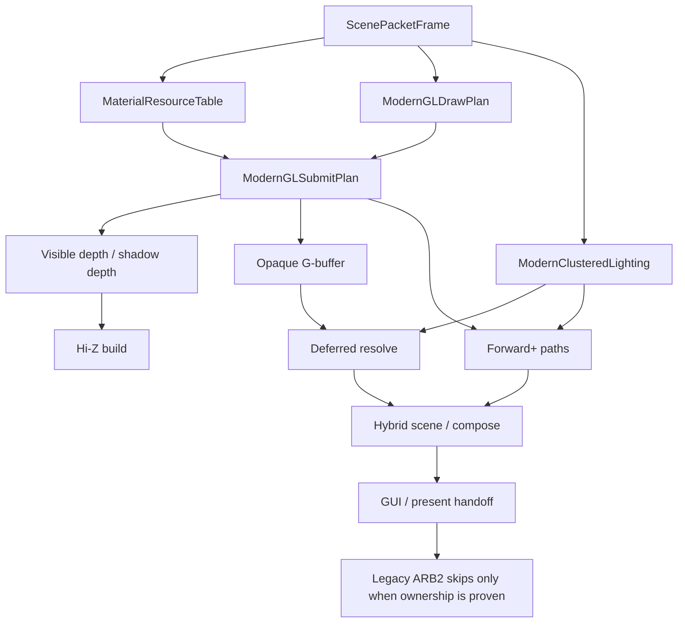

# Reworked GL Renderer Audit for OpenQ4

## Executive summary

I analyzed the `reworked-gl-renderer` branch primarily in `themuffinator/OpenQ4`, which contains the renderer implementation, plans, self-tests, and benchmark tooling. The branch has already built a substantial modern-renderer scaffold: tiered OpenGL policy from GL 3.3 through GL 4.6, a packet-backed render graph, `GLStateCache`, `MaterialResourceTable`, `RendererUpload`, a built-in GLSL shader library, draw/submit plans, clustered-light and shadow planners, and scripted benchmark coverage. However, the branch is still best described as a **partially promoted sidecar / fail-closed modern path**, not yet a production replacement for the legacy ARB2 renderer. The smoking-gun indicators are: `RB_ExecuteBackEndCommands` still calls `R_ModernGLExecutor_PrepareFrame(...)` before the legacy ARB2 command stream and composes later at swap; the modern pass-ownership logic intentionally blocks replacement when interaction lights, fog/blend lights, light-grid contribution, or shadow ownership are incomplete; and the modern path still performs substantial per-draw CPU work even when it does execute. fileciteturn56file0L3-L3 fileciteturn42file0L3-L3 fileciteturn53file0L3-L3 fileciteturn54file0L3-L3

The highest-confidence performance conclusion is that the branch’s current bottleneck is **CPU submission overhead**, not missing “modern features” in the abstract. The main reasons are structural and visible directly in code: the draw plan preserves packet order instead of aggressively reordering opaque work for state locality; every submitted draw rebinds program/UBO/textures and reissues six attribute enables/pointers; the “GPU-driven” path only batches commands that match a single first-seen signature; clustered lighting still has a CPU-heavy binning/build/upload phase; and the executor frequently tears state back down to zero or fully invalidates caches between passes. Those are exactly the kinds of patterns that erode frame time long before theoretical ALU or bandwidth limits are reached. fileciteturn32file0L3-L3 fileciteturn46file0L3-L3 fileciteturn45file0L3-L3 fileciteturn34file0L3-L3 fileciteturn51file0L3-L3

The most important positive finding is that the branch already contains enough infrastructure to fix these issues **without another foundational rewrite**. In particular, the render graph resource manager already tracks transient lifetimes and caches FBO layouts, the upload manager already supports persistent mapped rings plus fences, the state cache already supports multi-bind and DSA on capable tiers, and the benchmark/reporting code already captures many of the right counters. That means the fastest road to higher FPS is to **finish the submission model** rather than to re-architect the renderer again. fileciteturn30file0L3-L3 fileciteturn44file0L3-L3 fileciteturn49file0L3-L3 fileciteturn50file0L3-L3 fileciteturn26file0L3-L3

### Top prioritized optimization opportunities

| Priority | Opportunity | Estimated FPS gain | Implementation complexity | Why it ranks here | Primary code targets |
|---|---|---:|---:|---|---|
| Highest | Cache vertex input setup and stop calling `glVertexAttribPointer` for every draw | High | Days | The current hot path re-enables/re-specifies six attributes per draw; this is a textbook CPU submit tax on OpenGL | `src/renderer/ModernGLExecutor.cpp` around the `BindDrawVertLayout` path in the 1700–2100 range and its call sites in the 2500–2860 range fileciteturn55file0L3-L3 fileciteturn46file0L3-L3 |
| Very high | Add opaque/depth state sorting and batch bucketing in the draw plan | High | Days | Today the plan mostly preserves source order; that preserves correctness but leaves large state locality wins on the table | `src/renderer/ModernGLDrawPlan.cpp` and `src/renderer/ModernGLSubmitPlan.cpp` in the 1–420 and 1–380 ranges fileciteturn33file0L3-L3 fileciteturn32file0L3-L3 |
| Very high | Move per-draw constants to a draw-record buffer and expand multi-draw indirect beyond one signature | High | 1–2 weeks | The current “GPU-driven” path only batches commands that match the first eligible signature and still depends on CPU-authored visibility | `src/renderer/ModernGLExecutor.cpp` around 2100–2260 and 2660–2760 fileciteturn45file0L3-L3 fileciteturn46file0L3-L3 |
| High | Make Hi-Z actually cull work, not just build a pyramid | High in dense scenes | 2–4 weeks | The branch builds a Hi-Z pyramid, but current visibility rejection is still scissor/frustum/screen-rect based | `src/renderer/ModernGLExecutor.cpp` around 2100–2260 and 3080–3165 fileciteturn45file0L3-L3 fileciteturn44file0L3-L3 |
| High | Rewrite clustered-light upload/buffering to compact CSR-style lists and add true GL 4.3 compute binning | Medium to High | 1–2 weeks | CPU binning, per-frame flattening, and list materialization are still substantial on the front end | `src/renderer/ModernClusteredLighting.cpp` around 520–760 and 700–1120 fileciteturn28file0L3-L3 fileciteturn27file0L3-L3 |
| Medium high | Collapse texture binding pressure with texture arrays or bindless on capable tiers | Medium | 1–2 weeks | Promoted materials still bind classic textures per draw; bindless is represented in the material table but disabled by default | `src/renderer/MaterialResourceTable.cpp`, `MaterialResourceTable.h`, `ModernGLExecutor.cpp` around 2500–2570 fileciteturn25file0L3-L3 fileciteturn24file0L3-L3 fileciteturn46file0L3-L3 |
| Medium | Reduce pass teardown and stop fully invalidating state between modern passes | Medium | Days | Full restore-to-zero and invalidation after submit/Hi-Z erases much of the benefit of `GLStateCache` | `src/renderer/ModernGLExecutor.cpp` around 2660–2690 and 3040–3075; `src/renderer/GLStateCache.cpp` | fileciteturn46file0L3-L3 fileciteturn43file0L3-L3 fileciteturn29file0L3-L3 |
| Medium | Broaden persistent-mapped streaming to frame UBOs, draw records, indirect records, and eliminate optional synchronous validation from normal runs | Medium | Days | The upload manager already supports persistent rings and fences, but the executor still uses `glBufferSubData` for frame constants and can perform blocking validation readbacks when enabled | `src/renderer/RendererUpload.cpp` around 190–340 and 490–535; `src/renderer/ModernGLExecutor.cpp` around 1710–1770 and 2190–2260 fileciteturn50file0L3-L3 fileciteturn51file0L3-L3 fileciteturn55file0L3-L3 fileciteturn45file0L3-L3 |

## Branch architecture and current rendering model

The branch target is clear and well-documented: a **GL-only, tiered, clustered hybrid deferred / forward+ renderer** that scales from a GL 3.3 baseline to GL 4.3 GPU-driven and GL 4.5 low-overhead tiers, while keeping the legacy ARB2 renderer as the rollback path until parity is proven. The intended pipeline is `ScenePacketFrame -> visibility/clustering/material-table -> render graph -> depth/shadow -> G-buffer -> clustered light assignment -> deferred resolve and/or forward+ -> post -> GUI/present`. The branch also explicitly treats GL 3.3 as the modern baseline, GL 4.3 as the first compute/SSBO/indirect tier, and GL 4.5 as the persistent-mapped / DSA / multi-bind tier. fileciteturn56file0L3-L3



Architecturally, the strongest parts of the branch are the systems underneath actual shading. `GLStateCache` centralizes program/VAO/buffer/framebuffer/texture/sampler/raster/depth/scissor state and has multi-bind helpers; `RenderGraphResources` tracks named resources, imported and transient handles, alias groups, physical allocations, and cached framebuffer attachment layouts; `RendererUpload` already supports persistent mapped rings, map-range fallback, subdata fallback, and fence-based retirement; and `ModernGLShaderLibrary` explicitly builds multiple program families across GLSL 330/410/430/450 tiers. That is a healthy foundation. fileciteturn29file0L3-L3 fileciteturn30file0L3-L3 fileciteturn31file0L3-L3 fileciteturn49file0L3-L3 fileciteturn50file0L3-L3 fileciteturn35file0L3-L3

The key architectural limitation is that the branch is **not yet authoritative for full visible frame ownership**. In the backend, `R_ModernGLExecutor_PrepareFrame(...)` runs before the legacy ARB2 command stream, the legacy backend still executes unless pass ownership explicitly suppresses it, and visible composition happens later at swap. That makes the modern path a guarded replacement path rather than the default owner of the frame. The pass-ownership code reinforces this: if ARB2 interaction lights, fog/blend lights, light-grid contribution, or shadow ownership still exist in the packet frame, the branch deliberately marks modern visible replacement as blocked and keeps legacy ownership. This is correct behavior, but it means FPS comparisons must distinguish between **“modern path executing”** and **“modern path replacing the frame.”** fileciteturn42file0L3-L3 fileciteturn53file0L3-L3 fileciteturn54file0L3-L3 fileciteturn48file0L3-L3

The branch also bakes in important platform realities. It is explicitly desktop OpenGL focused; GL 4.1 is treated as a macOS-class feature tier, GL 4.3 as the first compute/indirect tier, and GL 4.5 as the first low-overhead tier. The repo’s RenderDoc workflow notes that current shipping ARB2 compatibility rendering is not a supported RenderDoc capture target, while upstream RenderDoc officially supports OpenGL 3.2–4.6 core but not OpenGL 1.0–2.0 compatibility. That matters operationally: capture and GPU-trace work should target forced modern/core-profile tiers, not the default ARB2 path. fileciteturn56file0L3-L3 fileciteturn37file0L3-L3 citeturn14view0

## Detailed code-level audit

The most consequential CPU-side anti-pattern is in `src/renderer/ModernGLExecutor.cpp`. The current submit path still looks, in effect, like this for each draw:

```cpp
UseProgram(program);
BindFrameUBO();
Set matrices and locals;
Bind/switch material textures;
Bind vertex/index buffers;
Enable + specify 6 vertex attributes;
Draw;
```

That behavior is visible in `R_ModernGLExecutor_SubmitCommand(...)`, which sets program state, uploads per-draw matrices through uniforms, binds classic textures per draw, binds vertex and index buffers, calls `R_ModernGLExecutor_BindDrawVertLayout(...)`, and only then issues `glDrawElements` or `glDrawArrays`. The layout helper itself enables and specifies six attributes every time. This is a classic submission-heavy OpenGL pattern and is exactly the sort of thing that modern batching is supposed to eliminate. fileciteturn46file0L3-L3 fileciteturn55file0L3-L3

The branch is leaving performance on the table in the draw plan itself. `src/renderer/ModernGLDrawPlan.cpp` computes transition counters and batch statistics but does not perform an aggressive opaque sort; it effectively walks packet order, classifies pipelines, and records when pipeline/program/material/geometry/texture/scissor changed. That is useful observability, but not enough optimization. The branch therefore pays the cost of lots of small state changes that it has already instrumented. In other words, the code knows when it is thrashing, but it still mostly thrashes. fileciteturn33file0L3-L3

The vertex-input path is particularly expensive. In current OpenGL semantics, `glVertexAttribPointer` stores source-buffer association and format in the VAO; rebinding `GL_ARRAY_BUFFER` afterward does nothing to the attribute association. Khronos explicitly documents that the newer separate-attribute-format path—`glBindVertexBuffer` together with `glVertexAttribFormat` / `glVertexAttribBinding`—lets applications keep the format fixed while changing only source buffer and base offset, which is a strong optimization when many vertices share the same format. That maps almost perfectly onto this branch, because OpenQ4’s `idDrawVert` layout is fixed and only the source buffer and base offset vary per draw. The current code is therefore using the most expensive valid model for a workload that naturally fits the cheaper one. fileciteturn55file0L3-L3 citeturn10view0turn10view1turn10view2

Resource management is better than the submit path, but still mixed. `RenderGraphResources` has a meaningful ownership model with imported/transient handles, physical allocation tracking, FBO completeness checks, aliasing, and explicit FBO caches for G-buffer and forward+ attachment layouts. The executor also records cache hits and only reattaches layouts on changes. That is good. But the fallback/classic paths still perform mutable attachment rebinding and completeness queries, and the executor frequently restores or invalidates large swaths of state after passes, which blunts the gains of the cache. This is not a foundational problem; it is mostly an execution-policy problem. fileciteturn30file0L3-L3 fileciteturn44file0L3-L3 fileciteturn47file0L3-L3 fileciteturn48file0L3-L3

The upload path is farther along than the renderer currently exploits. `RendererUpload` already supports persistent mapped ring buffers on capable drivers, map-range streaming otherwise, subdata fallback when necessary, triple frame buffers, and fence retirement. That aligns well with Khronos guidance, which warns that the real hazard in buffer streaming is implicit synchronization and recommends either explicit multiple buffering, orphaning, or persistent mapped regions with fences. In OpenQ4’s implementation, though, the upload manager is mostly used for frame-temp uploads like client index data, while the executor still updates its frame UBO with `glBufferSubData` / `glNamedBufferSubData`. Meanwhile, fence retirement can become blocking on frame-buffer rotation if the quick wait times out. So the infrastructure is modern, but the highest-frequency data paths are not fully routed through it yet. fileciteturn49file0L3-L3 fileciteturn50file0L3-L3 fileciteturn51file0L3-L3 fileciteturn55file0L3-L3 citeturn9view0

The “GPU-driven” path is important, but currently narrower than the name suggests. In `ModernGLExecutor.cpp`, the branch builds scene records from CPU-authored visibility decisions, opens the first eligible indirect batch signature, and only keeps commands indirect-eligible while they continue matching that signature. It then dispatches a compute shader to write/validate indirect records and, if validation is on, reads counters back via `glGetBufferSubData`. That means the current path is best understood as **indirect-submit validation and batching for a homogeneous run of commands**, not as true GPU culling plus broad MDI submission. Since `glMultiDrawElementsIndirect` can replace many indexed draw calls with one API call when the parameter block is already in a buffer, broadening this path represents one of the clearest high-payoff upgrades available to the branch. fileciteturn45file0L3-L3 fileciteturn46file0L3-L3 citeturn12view1

Clustered lighting remains another likely hotspot. `ModernClusteredLighting.cpp` still bins lights on the CPU and then flattens per-cluster light references into uploadable records. The binning code iterates explicitly across Z, Y, and X cluster ranges for each light, and the frame build code allocates and fills upload arrays for light records and index records before handing them to UBO/SSBO update paths. The branch’s own docs describe this as a deliberate GL 3.3-compatible baseline that still needs a fuller GL 4.3 compute path. That matches the code: it is correct scaffolding and solid for compatibility, but it is not the lowest-cost way to handle heavy light counts. fileciteturn28file0L3-L3 fileciteturn27file0L3-L3 fileciteturn40file0L3-L3

The visibility story is also only half-finished. The branch now builds a Hi-Z depth pyramid explicitly, using a depth blit into level zero followed by fullscreen reduction passes for higher mips. That is materially better than a naïve legacy path and avoids some older pitfalls. But the actual current visibility rejection in `R_ModernGLExecutor_CommandVisibleForModernPath(...)` is still conservative CPU-side logic: base scissor validity, frustum reject, and screen-rect clip/reject. The function tracks Hi-Z candidacy, but it does not actually consume Hi-Z to reject draws. So the branch does the cost of building Hi-Z without yet getting the full reward of using it for same-frame work reduction. fileciteturn43file0L3-L3 fileciteturn44file0L3-L3

The following table condenses the most important code-level findings.

| Current behavior | Why it matters | Evidence |
|---|---|---|
| Per-draw rebinding of program, UBOs, textures, matrices, depth range, cull, scissor, VBO/IBO, then immediate draw | High CPU driver overhead; weak state locality | `src/renderer/ModernGLExecutor.cpp`, `R_ModernGLExecutor_SubmitCommand(...)` in the 2500–2860 range fileciteturn46file0L3-L3 |
| Six `glEnableVertexAttribArray` / `glVertexAttribPointer` equivalent state setup operations in the hot path | Large per-draw submission cost; especially harmful under high draw counts | `src/renderer/ModernGLExecutor.cpp`, `R_ModernGLExecutor_BindDrawVertLayout(...)` in the 1700–2100 range fileciteturn55file0L3-L3 |
| Draw plan measures batch transitions but mostly preserves packet order | Opaque and depth work are under-batched | `src/renderer/ModernGLDrawPlan.cpp` in the 1–420 range fileciteturn33file0L3-L3 |
| GPU-driven path only keeps commands eligible while they match a single first-seen batch signature | MDI cannot scale across realistic mixed-material scenes yet | `src/renderer/ModernGLExecutor.cpp` in the 2100–2260 range fileciteturn45file0L3-L3 |
| Hi-Z pyramid is built, but visibility rejection remains scissor/frustum/screen-rect based | Pyramid cost is paid before its main culling benefit is realized | `src/renderer/ModernGLExecutor.cpp` in the 2100–2260 and 3080–3165 ranges fileciteturn45file0L3-L3 fileciteturn44file0L3-L3 |
| Clustered lighting still does CPU binning and per-frame flattening of lists | Strong front-end cost in light-heavy scenes | `src/renderer/ModernClusteredLighting.cpp` in the 520–760 and 700–1120 ranges fileciteturn28file0L3-L3 fileciteturn27file0L3-L3 |
| Upload manager already has persistent/map-range/subdata tiers, but frame UBO updates still go through buffer subdata | Existing low-overhead path is underused | `src/renderer/RendererUpload.cpp` and `ModernGLExecutor.cpp` around the frame UBO update path fileciteturn50file0L3-L3 fileciteturn55file0L3-L3 |
| Full restore-to-zero after modern passes | Erases cache locality between passes and increases churn | `src/renderer/ModernGLExecutor.cpp`, `R_ModernGLExecutor_RestoreAfterSubmit(...)` and `R_ModernGLExecutor_RestoreAfterHiZBuild(...)` fileciteturn46file0L3-L3 fileciteturn43file0L3-L3 |

## Profiling and benchmark plan

The branch already contains a practical benchmark harness. `tools/tests/renderer_gameplay_benchmark.py` defines scene coverage for `game/airdefense1`, `game/airdefense2`, `game/storage2`, `game/medlabs`, `game/mcc_landing`, and `mp/q4dm1`, plus additional shadow-specific scenes and preset matrices for tiers, presentation, and shadow modes. `RendererBenchmarks.h` shows that the engine can already record frame time, front-end time, visibility time, packet/graph/submit time, GPU frame time, per-pass GPU timer samples, upload bytes, draw statistics, scene packet counts, render graph counts, cluster counts, and fallback counters. This is already enough to isolate CPU-vs-GPU cliffs if used systematically. fileciteturn38file0L3-L3 fileciteturn36file0L3-L3

A reproducible benchmark matrix should start with **one ARB2 baseline**, then replay the same scene with modern features enabled one at a time, then run tier matrices. The repo’s own parity/recovery plans explicitly recommend exactly that: establish ARB2 P50/P95/P99 baselines, enable modern cvars one at a time to find the first FPS cliff, and test shadow presets separately. For this branch, the minimum test matrix should be: `ARB2 baseline`, `modern executor only`, `visible depth only`, `G-buffer only`, `deferred only`, `forward+ only`, `Hi-Z only`, `GPU validation off/on`, `shadow map off/on`, and then `auto`, `gl33`, `gl43`, and `gl45`. fileciteturn40file0L3-L3 fileciteturn41file0L3-L3

Recommended engine-side settings for performance runs are straightforward: disable presentation caps with `r_swapInterval 0`, test both `com_maxfps 0` and `com_maxfps 240`, enable `r_rendererMetrics 2`, enable `r_rendererGpuTimers 1`, keep `r_rendererGpuValidation 0` for normal runs, and only enable `r_rendererGpuValidation 1` in dedicated validation passes because asynchronous query and readback mechanisms become synchronous if you ask for results too early. Khronos’s query-object documentation is explicit on that point: retrieving `GL_QUERY_RESULT` before `GL_QUERY_RESULT_AVAILABLE` is true stalls the CPU; `GL_QUERY_RESULT_NO_WAIT` or availability polling should be used instead. fileciteturn40file0L3-L3 citeturn13view2

Recommended benchmark invocations, based on the current branch’s tooling and documentation, are:

```bash
python tools/tests/renderer_gameplay_benchmark.py \
  --profile required \
  --settle-frames 120 \
  --sample-frames 600 \
  --timeout 900 \
  --output-dir .tmp/renderer-gameplay/required
```

```bash
python tools/tests/renderer_gameplay_benchmark.py \
  --profile tiers \
  --cases sp-airdefense1 sp-airdefense2 sp-storage2 \
  --tiers auto gl33 gl43 gl45 \
  --maxfps 240 \
  --swap 0 \
  --display windowed \
  --output-dir .tmp/renderer-gameplay/tiers
```

```bash
python tools/tests/renderer_validation_matrix.py \
  --tiers auto gl33 gl43 gl45 \
  --timeout 120 \
  --output-dir .tmp/renderer-validation/full
```

Those commands are the right shape for the current repo because the benchmark script already defines those profiles and maps, and the recovery plans already use the validation matrix and short gameplay runs as acceptance steps. fileciteturn38file0L3-L3 fileciteturn41file0L3-L3

For external profiling, I recommend a split workflow by problem type and platform:

| Goal | Linux | Windows | Notes |
|---|---|---|---|
| CPU hotspot attribution | `perf stat -d -d -d --repeat 5 -- <cmd>` and `perf record -g --call-graph dwarf,4096 -- <cmd>` | WPR/WPA ETW trace for CPU scheduling, module load, and driver overhead | `perf stat` is the correct lowest-friction CPU counter tool on Linux, and `perf record --call-graph dwarf` is explicitly recommended when binaries omit frame pointers. WPR/WPA is Microsoft’s ETW-based system profiler. citeturn18view0turn19view0turn19view1turn17view1 |
| Whole-system CPU/GPU timeline | Nsight Systems | Nsight Systems | Nsight Systems explicitly supports focused profiling and CLI capture; use NVTX or a short capture range to isolate steady-state gameplay. citeturn16view1 |
| GPU trace and GPU-unit utilization | Nsight Graphics on NVIDIA; RenderDoc for frame inspection in core-profile mode | Nsight Graphics on NVIDIA; RenderDoc for frame inspection in core-profile mode | Nsight Graphics officially supports OpenGL profiling, GPU Trace, throughput, cache hit rates, and OpenGL frame debugging. RenderDoc supports OpenGL 3.2–4.6 core, not 1.x–2.x compatibility. citeturn21view0turn14view0 |
| API-call capture and pass inspection | RenderDoc in forced core-profile tiers only | RenderDoc in forced core-profile tiers only | The repo itself warns that the current ARB2 compatibility renderer is not a supported RenderDoc path. fileciteturn37file0L3-L3 |

For Linux CPU capture, these concrete commands are the most useful first pass:

```bash
perf stat -d -d -d --repeat 5 -- ./openq4 +set r_swapInterval 0 +set com_maxfps 240 ...
```

```bash
perf record -g --call-graph dwarf,4096 -- ./openq4 +set r_swapInterval 0 +set com_maxfps 240 ...
perf report
```

`perf stat` is designed to run a command and gather performance-counter statistics, and the manual explicitly documents `-d -d -d` for increasingly detailed event summaries. `perf record` documents `--call-graph dwarf` and explains why DWARF unwinding is preferable when frame pointers are omitted. citeturn18view0turn19view0turn19view1

The branch’s benchmark scenes can also be mapped directly to likely hotspots:

| Scene | Why it is valuable | Expected bottleneck focus |
|---|---|---|
| `game/airdefense1` | Outdoor baseline, terrain decals, smoke | Visibility, batch count, overdraw, presentation |
| `game/airdefense2` | Flashlight, projected shadows, animated characters | clustered lighting, shadow planning, view/model transforms |
| `game/storage2` | Indoor dense lights and post coverage | G-buffer, forward+, light-list pressure |
| `game/medlabs` | BSE-heavy content | fallback ownership, special-effects interaction |
| `game/mcc_landing` | Subviews, remote cameras, GUI | pass-ownership blocks, composition, per-view grids |
| `mp/q4dm1` | Listen-server parity | CPU front-end overhead and duplicated work under gameplay |

These scene definitions are already present in the repo’s benchmark script. fileciteturn38file0L3-L3

## Concrete optimization proposals and implementation roadmap

The following proposals are intentionally scoped against **actual current code paths** rather than a hypothetical future renderer. The FPS-gain bands are directional, based on code structure and OpenGL behavior, not on measured hardware-specific deltas.

| Proposal | Expected FPS gain | Estimated effort | Main risks | Required code changes | Patch sketch |
|---|---:|---:|---|---|---|
| **Vertex-input state cache and GL 4.3 vertex-binding path** | High | 2–4 days | Low; mostly localized | `src/renderer/ModernGLExecutor.cpp` around `R_ModernGLExecutor_BindDrawVertLayout(...)` and submit call sites | On GL 4.3+, define format once with `glVertexAttribFormat` / `glVertexAttribBinding`, then issue only `glBindVertexBuffer` per source change; on GL 3.3, add a `{vbo,stride,baseOffset}` cache key so repeated draws skip layout reissue. |
| **Opaque/depth sorting and submission bucketing** | High | 3–6 days | Medium; must preserve transparent/post ordering | `src/renderer/ModernGLDrawPlan.cpp`, `src/renderer/ModernGLSubmitPlan.cpp` | Sort only opaque/depth/G-buffer-compatible work by `(pipeline, program, material, vbo, ibo, scissor bucket)` while preserving stable order for transparent, GUI, post, and semantically ordered surfaces. Add counters for sort effectiveness. |
| **Per-draw record buffer plus multi-batch MDI** | High | 1–2 weeks | Medium to high; needs shader ABI work | `src/renderer/ModernGLExecutor.cpp` around GPU-driven update/submit, `ModernGLSubmitPlan.*`, `ModernGLShaderLibrary.*` | Move matrices, material IDs, alpha refs, and flags into a UBO/SSBO draw-record array; generate multiple indirect buckets keyed by program/layout/material scheme; issue one `glMultiDrawElementsIndirect` per bucket. |
| **Consume Hi-Z for actual culling and indirect compaction** | High in dense scenes | 2–4 weeks | High; false negatives would be visually catastrophic | `src/renderer/ModernGLExecutor.cpp` around visibility tests, Hi-Z build, GPU-driven compute; shader library add-ons | Add a conservative screen-bounds + mip-choice compute pass, write visibility bitmasks, prefix-sum compact visible commands, and feed indirect buffers. Keep CPU fallback and debug-only readback. |
| **Clustered-light data structure rewrite** | Medium to High | 1–2 weeks | Medium; cross-tier correctness work | `src/renderer/ModernClusteredLighting.cpp`, shader library cluster-fetch code | Replace ad hoc flattening with CSR-style `(offset,count)` records plus flat index arrays, reuse per-frame arrays, add per-view grids everywhere, and add a real GL 4.3 compute binning path while preserving current GL 3.3 CPU path. |
| **Texture-binding collapse with arrays / bindless where safe** | Medium | 1–2 weeks | Medium; material compatibility and residency rules | `src/renderer/MaterialResourceTable.*`, `ModernGLExecutor.cpp` texture binding path | Keep classic slots on GL 3.3, but on higher tiers pack promotable material families into arrays or bindless handles, set sampler uniforms once at program creation, and drive per-draw texture selection from material indices instead of rebinding four textures every draw. |
| **Soft restore rather than full teardown between modern passes** | Medium | 2–5 days | Low to medium; stale-state bugs if done carelessly | `src/renderer/ModernGLExecutor.cpp`, `GLStateCache.cpp` | Split restore into `SoftRestoreForNextModernPass()` and `FullRestoreForLegacyHandoff()`. Avoid zeroing textures/VAO/program/framebuffer and avoid `GL_ClearStateDelta()` when the next consumer is another modern pass. |
| **Broaden upload-manager usage and reduce synchronous waits** | Medium | 3–5 days | Low to medium; fence starvation if undersized | `src/renderer/RendererUpload.cpp`, `ModernGLExecutor.cpp` frame UBO / indirect / validation paths | Route frame constants, draw records, and indirect parameters through the upload manager; add a larger or configurable fence-rotation depth for pathological frames; keep validation readbacks fully opt-in and deferred. |

The first two items are the best near-term investments because they directly attack the worst visible CPU side effects with relatively small surface area. The Khronos guidance on vertex format state and streaming strongly supports them: attribute associations are stored when `glVertexAttribPointer` is called, not when `GL_ARRAY_BUFFER` changes, and persistent-or-orphaned streaming is preferred specifically to avoid implicit synchronization. The current branch is doing the expensive thing in both areas even though its own abstractions are ready for the cheaper thing. citeturn10view0turn10view1turn10view2turn9view0turn12view0

A particularly important design note: I do **not** recommend trying to “just turn on bindless everywhere” as the first step. The branch already models bindless capability in the material table, but because visible replacement still depends on conservative material promotion and fallback correctness, bindless should be a **second-wave batching multiplier**, not the first safety-critical change. The safest first move is to win with stable opaque sorting, reduced vertex-format churn, and multi-batch indirect that still works with classic bindings. fileciteturn24file0L3-L3 fileciteturn25file0L3-L3

The following current-vs-target view captures the intended effect of the roadmap:

| Area | Current branch behavior | Target behavior after roadmap |
|---|---|---|
| Opaque submission | Mostly packet-order traversal with many state transitions | Sorted buckets with sharply fewer program/material/VBO switches |
| Vertex input | Attribute enable/format state rebuilt in the hot path | Static VAO format + one source-buffer/base-offset bind on capable tiers |
| Indirect drawing | One homogeneous signature bucket at most | Multiple buckets per frame with per-draw data fetched from buffers |
| Hi-Z | Pyramid built, but not consumed for rejection | Visible draw compaction and reduced work in dense occluded scenes |
| Cluster upload | CPU binning + flattening + upload each frame | Reused compact lists, per-view grids, compute assist on GL 4.3+ |
| Frame constants | Single UBO updated with buffer subdata each frame | Upload-manager-backed ring or mapped region with minimal stalls |
| Modern pass handoff | Heavy full restore between passes | Cheap intra-modern transitions and full restore only at legacy handoff |

```mermaid
gantt
    title Recommended implementation sequence
    dateFormat  X
    axisFormat  %L

    section Quick wins
    Vertex input cache and vertex-binding path :a1, 0, 3d
    Soft restore and sampler-uniform cleanup   :a2, after a1, 2d
    Opaque/depth sorting and bucket metrics    :a3, after a1, 5d

    section Medium horizon
    Draw-record buffer and multi-batch MDI     :a4, after a3, 8d
    Cluster list compaction and per-view grids :a5, after a3, 8d
    Texture array or bindless promotion        :a6, after a4, 8d

    section Longer horizon
    Hi-Z consumption and GPU compaction        :a7, after a4, 12d
    Full lighting and shadow parity promotion  :a8, after a5, 15d
```



## Validation strategy and open questions

Every optimization above should ship with a corresponding **microbenchmark**, **unit/self-test extension**, and **visual regression gate**. The branch already has a strong self-test culture—plans and docs reference tests such as `rendererGLStateCacheSelfTest`, `rendererRenderGraphResourceSelfTest`, `rendererMaterialResourceTableSelfTest`, `rendererModernGLDrawPlanSelfTest`, `rendererModernGLSubmitPlanSelfTest`, `rendererModernGLExecutorSelfTest`, `rendererClusterGridSelfTest`, `rendererGpuDrivenSelfTest`, `rendererLowOverheadSelfTest`, and visible-path / default-promotion tests. Extend that system rather than inventing a parallel harness. fileciteturn56file0L3-L3 fileciteturn41file0L3-L3

The most useful synthetic tests are:

| Optimization | Microbenchmark | Pass criterion |
|---|---|---|
| Vertex-input cache | 10k repeated draws with identical `idDrawVert` format and varying offsets | Attribute-format calls drop toward zero per draw on GL 4.3+ |
| Opaque sorting | Same geometry in randomized material/program order | Program/material batch counts and CPU submit time fall measurably |
| Multi-batch MDI | Mix of repeated mesh/material groups with stable per-draw records | Draw-call count collapses to bucket count; GPU output remains identical |
| Hi-Z culling | Courtyard scene with many fully occluded boxes behind large occluders | Nonzero conservative rejection counts and lower CPU/GPU pass time |
| Cluster rewrite | Synthetic 1, 32, 128, and 512-light scenes | Light loss stays zero in non-overflow budgets; front-end time scales better |
| Upload rewrite | Frame-constant churn and client-index upload stress | Fence waits and subdata writes decrease; no corrupted draws |
| Soft restore | Repeated depth → G-buffer → deferred → forward runs | State-cache invalidations fall sharply with no stale-state artifacts |

Real-scene regression should use the existing benchmark maps plus a small screenshot-diff regime. The branch’s own promotion/evidence plans already define the right acceptance gates: zero renderer warnings, no `droppedByModern`, no duplicate ownership for modern-owned passes, rollback still safe after modern frames, and ARB2-or-better P95/P99 before any default promotion. That is the correct policy; keep it. fileciteturn41file0L3-L3

The main limitations of this report are straightforward. I did not run the branch on target hardware, so the FPS estimates are directional and based on code-path cost, existing repo benchmarking scaffolding, and official API guidance rather than measured frame captures. Also, the GitHub connector comparison indicates that `themuffinator/OpenQ4-GameLibs` does not contribute a substantive renderer-side delta on this branch, so the deep technical analysis is overwhelmingly centered on `themuffinator/OpenQ4`. Finally, some repo planning documents are clearly work-in-progress; where a plan note and code differed, I prioritized the current code path over the older plan language. fileciteturn40file0L3-L3 fileciteturn41file0L3-L3

The bottom line is that the new renderer is **architecturally promising, instrumented well, and already equipped with the right internal abstractions**, but its present performance ceiling is being held back by a still-legacy submission model. If you want the fastest route to materially higher FPS on this branch, do not start with exotic features; start by cashing in the wins the branch has already prepared for: **state-local sorting, stable vertex-input state, broad indirect batching, real Hi-Z consumers, and wider use of the existing upload manager.** Those changes line up cleanly with both the current code and Khronos/OpenGL best practice. fileciteturn56file0L3-L3 fileciteturn46file0L3-L3 citeturn9view0turn10view1turn12view0turn12view1turn13view2