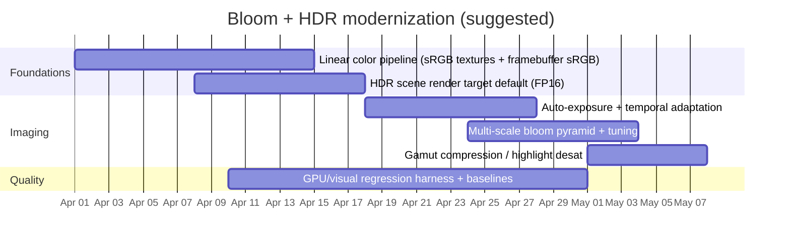

# Bloom and HDR Post-Processing in themuffinator/OpenQ4

## Executive summary

The repository implements bloom as a **single-scale, separable Gaussian blur** driven by a **soft-knee bright-pass** stage, then composites bloom **before** applying a filmic tone-mapper and an LDR-style color-grade stack (lift/gamma/gain, vibrance, saturation, contrast). This matches the *overall* ordering used in many real-time pipelines (bloom in scene-referred space → tone map → grade), but the *fidelity* of the “HDR” claim hinges on whether the main scene is actually rendered into a floating-point render target at the moment the pipeline captures the scene. If it’s copied from an LDR back buffer, the pipeline becomes “filmic + bloom on clamped LDR,” which cannot reproduce true HDR highlight structure and will bias thresholding, glare extent, and tonemapper behavior.

Key findings:

- **Bloom math is conventional and mostly robust** (soft knee, tent prefilter, normalized weights), and the GPU cost is modest; however **single-scale blur** will not reproduce real glare’s multi-lobe point-spread behavior and can exhibit “one-ring halo” aesthetics rather than camera/eye scatter. citeturn6search3  
- The filmic curve used is the widely copied “ACES filmic fit” (per-channel curve) rather than an actual ACES RRT/ODT pipeline; the repo does not implement ACES’s hue-preserving / gamut-compression behaviors, increasing risk of highlight hue skews and out-of-gamut clipping artifacts. citeturn6search0turn9search0  
- **Color-space management is the largest technical risk**: without explicit sRGB decode/encode or `GL_FRAMEBUFFER_SRGB`-style handling, the tonemapper/thresholding may operate in non-linear space, which is perceptually and physically inconsistent. citeturn7search0turn7search7  
- Human optics assumptions are simplified (thresholded bloom, no adaptation-driven glare scaling, no disability glare / veiling-luminance model). The literature shows glare is better modeled as a luminance-dependent PSF convolution with wide support and often structured halos. citeturn6search3turn8search7  
- The implementation is a good pragmatic baseline, but **it is not a complete HDR imaging pipeline** in the academic/industry sense (scene-referred HDR + controlled display transform + adaptation + gamut management). citeturn6search2turn8search0turn6search0  

## Implementation snapshot

### Where bloom/HDR live in the repo (best-effort map)

- **Main orchestration (CPU side):** `src/renderer/draw_common.cpp` (look for the bloom/tone-map post step and references to `bloom*` programs).  
- **CVar surface / feature toggles:** `src/renderer/tr_local.h` declares bloom and “HDR tone map” knobs (`r_bloom*`, `r_hdr*`).  
- **Scene capture and texture plumbing:**  
  - `src/renderer/Image.h` declares `currentRenderImage` / `originalCurrentRenderImage` and scene-copy usage.  
  - `src/renderer/Image_intrinsic.cpp` creates the intrinsic FP16 images (notably `FMT_RGBA16F` for the scene copy images).  
  - `src/renderer/Image_load.cpp` implements `idImage::CopyFramebuffer(...)` and shows the “copy-from-renderTexture vs copy-from-default-FBO” split.

### Shaders (bloom + “HDR” tonemap + grade)

- `openq4/glprogs/bloom_extract.fs`  
  Downsampled prefilter + soft-knee threshold extraction.
- `openq4/glprogs/bloom_blur.fs`  
  7-sample separable blur pass (horizontal/vertical via a uniform direction).
- `openq4/glprogs/bloom.fs`  
  Composite bloom + filmic tone map + color adjustments.

Note: The repo also contains `.install/openq4/glprogs/...` duplicates; these can cause “edited the wrong file” workflow errors if your build/package step sources the `.install` tree for shipping.

## Detailed code review and technical critique

### Scene capture, “HDR” viability, and precision

**FP16 intermediate capability exists, but true HDR depends on the source buffer.** The repo creates `currentRenderImage` and `originalCurrentRenderImage` as `FMT_RGBA16F` intrinsic images, which is the right minimum baseline for HDR post effects (reduced banding, safer accumulation, more stable bloom weights). However, `idImage::CopyFramebuffer(...)` makes it explicit that capture is either:

- **From an active renderTexture (FBO)** via `glBlitFramebuffer(...)` into the texture, or  
- **From the default framebuffer** via `glCopyTex(Sub)Image2D(...)`.  

If the default framebuffer is fixed-point (typical `RGBA8`), HDR information above 1.0 is **already clipped** before the copy, so bloom thresholding and tone mapping operate on LDR. In contrast, if the scene was rendered into a floating-point render target attached to `backEnd.renderTexture`, HDR can be preserved through the blit/copy path. This difference is foundational: it determines whether parameters like “threshold > 1” behave as industry guidance expects. citeturn9search1

**Robustness notes:**
- The copy path explicitly disables scissor during blits/copies to avoid accidental clipping from earlier light scissor state—this is correct and prevents extremely hard-to-debug partial copies.  
- The capture code resizes storage when needed; this is fine for resolution changes but implies a potential hitch if resolution changes frequently (dynamic resolution /-window resizes).  
- There is an implicit assumption that the copy is a faithful “scene-referred” buffer. In legacy pipelines that still do substantial lighting in a gamma-like space (or apply gamma ramps later), this assumption can be violated, and the post chain becomes numerically “correct” but semantically wrong.

**Actionable diagnostic:** Add a debug view mode that renders a small on-screen heatmap of `max(scene.rgb)` *before* tone mapping, and log whether values exceed 1.0 in typical scenes. If you never exceed ~1.0 except for rare cases, your “HDR” is effectively LDR and you should tune threshold/curve accordingly (or fix the render target).

### Bloom extraction: thresholding model and optics assumptions

The bright-pass shader implements a **soft-knee threshold** of the form widely used in modern bloom implementations:  
- Compute brightness (in this repo: `max(r,g,b)`), apply a “knee” region, and normalize contribution by brightness to preserve chroma structure. This is essentially the same soft-knee model described in commonly referenced implementations. citeturn9search3turn9search1  

**Strengths**
- The prefilter uses a **3×3 tent** (weights sum to 1), which reduces aliasing/shimmer from subpixel highlights and makes bloom more temporally stable.  
- Soft knee avoids a hard “cut line,” which is critical for stable bloom under animation and exposure changes. citeturn9search3  

**Key weaknesses / correctness risks**
- **Brightness metric = max channel** rather than luminance. This causes saturated primaries to bloom more aggressively than their luminance would predict, and can exaggerate colored haloing (especially strong reds/blues). In physically based glare, the driver is retinal illuminance / luminance-like response, not max channel. The perceptual literature models adaptation and visibility using luminance and contrast sensitivity rather than max-RGB heuristics. citeturn8search0turn6search3  
- **No exposure coupling**. If bloom is supposed to represent camera/eye overload, the amount and *extent* of bloom should depend on exposure/adaptation state (or at least operate in consistently exposure-scaled scene-referred units). Visual adaptation models explicitly include time dependence and luminance-range effects. citeturn8search0turn8search49  
- **Threshold semantics depend on HDR reality.** Industry guidance assumes HDR bloom threshold is set just above 1.0 so only true highlights contribute. If the pipeline is LDR-clamped, the same guideline becomes meaningless and forces threshold < 1, which starts blooming midtones/whites (a different aesthetic). citeturn9search1  

### Blur kernel design: separable Gaussian, quality limits, and scaling behavior

The blur pass is a **fixed-weight 7-sample separable Gaussian** with symmetric taps and normalized weights. This is efficient and typically adequate for moderate-radius bloom.

**Performance/quality trade-offs**
- Separable blur is an efficient baseline; doing a single half-resolution blur is usually “cheap enough” for most GPUs.  
- The blur radius is implemented by scaling sample offsets (`stepSize * blurRadius`) while keeping weights constant. This is fast, but as radius grows it becomes a sparse approximation rather than a true wider Gaussian—risking “layered halos” or excessively smooth plateaus depending on content.  

**Optics realism gap**
Real glare (eye/camera) is not well approximated by a single Gaussian at a single scale. Research-based glare models treat glare as a **PSF with wide support**, sometimes including structured halo components and long tails; multi-scale or PSF-based approaches reproduce these behaviors better. citeturn6search3turn8search7  

### Composite + tone mapping + grading: ordering, color science, and clipping

The composite shader performs:

1. Add bloom (scaled) into the scene color.
2. Apply a per-channel filmic curve often labeled “ACES filmic.”
3. Apply post-tonemap grading ops (lift/gamma/gain, vibrance, saturation, contrast), then clamp to [0,1].

**Ordering is directionally correct** for the common “bloom in scene-referred HDR → tone map → grade” approach. The main risk is **whether step (2) operates in linear scene-referred space**.

**Major accuracy issues vs best practice**
- **Color space is unspecified.** If your scene buffer is in a gamma-like space, then thresholding, blur energy, and the filmic curve will all be wrong (most notably: midtones will compress incorrectly, and bloom will over-respond). Proper HDR pipelines explicitly linearize inputs and linearize blending; OpenGL supports this via sRGB textures and framebuffer sRGB conversion, but the repo’s broader rendering path would need to opt into it consistently. citeturn7search7turn7search0  
- **Not actually ACES.** The “ACES filmic” scalar curve is a popular fit, but ACES as a system includes color space transforms and a tone-mapping + gamut/white-limiting design that is more complex than a per-channel curve. ACES documentation explicitly describes tone mapping in a perceptual space (JMh) with additional chroma/gamut handling and constraints. citeturn6search0turn9search0  
- **No gamut mapping, only clamp.** Hard clamping after aggressive grading can cause hue skews, banding near the shoulder, and “neon” clipping artifacts. ACES-style pipelines mitigate this via chroma/gamut compression and white limiting rather than raw clamp. citeturn9search0  

**What’s missing if you call it “HDR”**
- **Auto exposure / adaptation** (log-average luminance, histogram, temporal smoothing). Tone reproduction operators in the literature (and perceptual adaptation models) emphasize adaptation as core to mapping HDR scenes to LDR displays. citeturn6search2turn8search0  
- **Display-referred management:** target peak luminance, display encoding, and consistent mapping to SDR/HDR output spaces. ACES targets this explicitly through output transforms. citeturn6search0turn9search0  
- **Glare model:** bloom is used as a proxy for disability glare/veiling luminance effects, but the literature treats this as a PSF convolution with quantifiable behavior rather than a thresholded blur. citeturn6search3turn8search7  

## Comparison to academic and industry best practices

Academic and standards guidance strongly suggests separating (a) **scene-referred HDR representation**, (b) **perceptually/plausibly motivated tone reproduction**, and (c) **display encoding and gamut handling**.

- **Tone mapping operators:** Reinhard et al. present a classic “photographic” operator designed specifically to compress HDR scenes for LDR display while preserving appearance cues; the key point is that mapping is driven by scene luminance statistics and photographic intuition rather than arbitrary clamps. citeturn6search2  
- **Perceptual adaptation:** Ferwerda et al. model adaptation mechanisms (thresholds, acuity, sensitivity changes) and show why a static curve is insufficient across wide luminance ranges; this directly motivates auto-exposure and temporal adaptation in interactive sequences. citeturn8search0turn8search49  
- **Glare/bloom:** Spencer et al. provide a psychophysically grounded glare model based on scattering/diffraction, producing PSFs that can “increase perceived dynamic range” by redistributing light around bright sources—conceptually similar to bloom but with substantially different spatial frequency characteristics and no arbitrary threshold cut. citeturn6search3turn6search48  
- **Standards-based color management:** SMPTE’s ACES standards define the interchange encoding and the pipeline foundations for consistent color reproduction; ACES technical docs emphasize monotonic tone scales, wide-range support, and explicit chroma/gamut controls rather than ad-hoc clamp-and-grade. citeturn6search0turn9search0  
- **Practical real-time bloom guidance:** Industry docs (e.g., Unity’s bloom) explicitly state that in a properly HDR pipeline, bloom threshold should be above the LDR range (>1.0) and include knobs like soft knee and anti-flicker filtering—very similar to what OpenQ4 implements, with the caveat that “HDR correctness” depends on the upstream buffer being HDR. citeturn9search1turn9search2turn9search3  

image_group{"layout":"carousel","aspect_ratio":"16:9","query":["physically based glare point spread function human eye scattering diffraction","bloom effect before after HDR rendering example","tone mapping curve ACES filmic vs Reinhard photographic operator graph","veiling glare disability glare diagram CIE"],"num_per_query":1}

## Prioritized improvement plan with effort, tests, and validation metrics

The plan below assumes no particular hardware constraints and targets “modern-correct” HDR + bloom behavior while preserving the current feature set.

### Establish color-space correctness as the foundation

**Change**
- Implement consistent **linear workflow**:  
  - Treat albedo/emissive textures as sRGB where appropriate, decode at sample time (sRGB textures) and ensure linear filtering in linear space.  
  - Enable framebuffer sRGB conversion for the final SDR back buffer (or render into an sRGB target with `GL_FRAMEBUFFER_SRGB`). citeturn7search7turn7search0  

**Why**
- Fixes the single biggest correctness risk: tonemapper and bloom threshold become meaningful only in linear scene-referred space.

**Effort**
- Medium to large (3–10 days) depending on how deep legacy texture formats and gamma ramps are embedded.

**Validation**
- Render gray ramps and verify that blending is linear (no mid-gray darkening).  
- Compare rendered “linear light add” tests against analytic expectations.  
- Visual regression: measure SSIM/ΔE on known test scenes after converting captures to a consistent reference space.

### Make HDR real (or rename the feature)

**Change**
- Ensure the main scene is rendered to an **FP16 (or FP11/FP10) HDR color target** prior to post-processing, rather than relying on copying from an LDR default framebuffer.  
- If the engine must remain LDR, explicitly redesign parameters and UI to reflect “LDR filmic + bloom,” and clamp/grade accordingly.

**Why**
- Enables true >1.0 highlights and makes “threshold just above 1” and “exposure” behave as expected. citeturn9search1  

**Effort**
- Medium (3–7 days) if an FBO-based renderTexture path already exists and can become the default.
- Larger if the engine’s lighting path assumes back-buffer rendering.

**Validation**
- Add instrumentation: histogram of scene luminance before tonemap; assert presence of values > 1.0 in known bright scenes.

### Add auto-exposure and temporal adaptation

**Change**
- Compute log-average luminance or a histogram from a downsample chain; apply temporal smoothing (separate brightening/darkening time constants).  
- Keep manual exposure as an override/offset.

**Why**
- Static exposure is inadequate across wide luminance ranges; adaptation is foundational in perceptual tone reproduction literature. citeturn6search2turn8search0  

**Effort**
- Medium (4–8 days).

**Validation**
- Use a scripted camera path from dark room → bright outdoors and measure:  
  - Time-to-half-response and time-to-stable exposure  
  - No oscillation (bounded derivative)  
- Visual regression: exposure curve over time should match expected adaptation constants.

### Upgrade bloom to multi-scale glare approximation

**Change**
- Replace single-scale blur with a **multi-scale pyramid** (mips or explicit downsample chain), and upsample/additively combine with scale-dependent weights.  
- Optionally add a PSF-inspired long-tail component (very low-res wide blur) to approximate veiling glare. citeturn6search3turn8search7  

**Why**
- Produces more natural bloom that better matches glare’s wide support and avoids the “single halo ring” look.

**Effort**
- Medium (3–7 days). If you already have downsample infrastructure, this becomes straightforward.

**Validation**
- Test with bright point lights on black: confirm halo shape matches chosen PSF/pyramid profile; compare radial falloff curves in a debug plot.

### Improve tonemapping and gamut handling

**Change**
- Either:
  - Keep the current filmic curve but add **highlight desaturation / gamut compression** before clamp, or  
  - Implement a simplified ACES-like output transform with explicit chroma/gamut compression and white limiting (even if not full CTL). citeturn9search0turn6search0  

**Why**
- Prevents saturated highlights from clipping to neon primaries; improves perceived plausibility.

**Effort**
- Small to medium (2–5 days).

**Validation**
- Use saturated HDR test patches above 1.0 and confirm hue stability through the shoulder.

## Suggested unit, integration, and visual regression tests

### Unit tests (CPU mirror of shader math)

Implement a small CPU reference for:
- Soft-knee prefilter/extraction (exact same equations). citeturn9search3  
- Tonemap curve monotonicity and white point behavior (verify `f(whitePoint) ≈ 1` with your scaling).  
- Lift/gamma/gain: ensure no NaNs for edge cases (0, negative after lift, extreme gamma).

**Metrics**
- Monotonicity checks over a dense input sampling.
- Max absolute error vs a known-good implementation for standard parameter sets.

### Integration tests (GPU rendered offscreen)

Create a deterministic offscreen test harness that:
- Renders synthetic patterns to the HDR scene target (single bright pixel, bright line, HDR ramps, HDR color checker).
- Runs the bloom/tonemap pipeline.
- Reads back the LDR result and compares against golden images.

**Metrics**
- SSIM (per-frame) plus a small allowed tolerance for driver differences.
- Histogram similarity (KL divergence) for tone mapping stability.

### Visual regression test scenes and images

Use a small set of “surgical” scenes:

- **Single emitter on black** (vary intensity across decades): validates bloom profile and tonemap shoulder.  
- **Specular sphere + area light**: validates highlight rolloff and color shifts.  
- **High-contrast signage**: catches halo ringing and threshold artifacts.  
- **Saturated HDR primaries**: stress-tests gamut compression and clipping.  
- **Dark-to-bright transition flythrough**: validates auto-exposure temporal behavior. citeturn8search0  

For static test images (if you ingest screenshots as textures):
- Linear ramp + step wedge.
- HDR color checker with >1.0 patches (if you support HDR texture formats).

## Diagrams, mermaid charts, and comparison tables

### Current processing pipeline (as implemented conceptually)

```mermaid
flowchart TD
  A[Main scene render] --> B[CopyFramebuffer -> currentRenderImage (RGBA16F)]
  B --> C[Downsample + tent prefilter + soft-knee bright-pass\nbloom_extract.fs]
  C --> D[Separable blur (H)\nbloom_blur.fs]
  D --> E[Separable blur (V)\nbloom_blur.fs]
  E --> F[Composite bloom + filmic tonemap + grade\nbloom.fs]
  F --> G[Back buffer / output]
```

### Suggested implementation timeline



### Comparison table: current vs proposed

| Aspect | Current implementation (repo) | Proposed change | Perf impact | Visual/physical impact | Complexity impact |
|---|---|---:|---:|---:|---:|
| Scene HDR validity | FP16 intermediates exist, but HDR depends on source buffer at copy time | Render scene into FP16 HDR target by default | ↑ small–medium (FBO + bandwidth) | ↑↑ (true highlights, meaningful threshold/exposure) | ↑ medium |
| Bloom structure | Single-scale half-res blur | Multi-scale pyramid (mips/downsample chain) + weighted upsample | ↑ small (more passes) | ↑↑ (more natural glare, fewer “one-ring” artifacts) | ↑ medium |
| Brightness metric | `max(r,g,b)` threshold driver | Luminance-based or exposure-scaled energy metric | ~ | ↑ (less saturated halo bias) | ↑ small |
| Tone mapping | Per-channel “ACES filmic fit” + clamp | Add gamut compression / white limiting; optionally ACES-like transform | ↑ small | ↑↑ (fewer hue skews / neon clipping) | ↑ medium |
| Adaptation | Manual exposure only | Auto-exposure + temporal smoothing | ↑ small | ↑↑ (stable across scenes, perceptual plausibility) | ↑ medium |
| Color space | Implicit/unspecified | Explicit linear workflow + sRGB decode/encode | depends | ↑↑ (correct blending/tonemap semantics) | ↑↑ (touches broad renderer) |

### Reference links (papers/standards cited)

```text
Reinhard et al. 2002 (Photographic tone reproduction): https://doi.org/10.1145/566654.566575

Spencer et al. 1995 (Physically-based glare effects): 
  Landing page: https://www.graphics.cornell.edu/pubs/1995/SSZG95.html
  PDF:          https://www.graphics.cornell.edu/pubs/1995/SSZG95.pdf

Ferwerda et al. 1996 (Visual adaptation model) DOI: https://doi.org/10.1145/237170.237262
  Cornell PDF: https://www.graphics.cornell.edu/pubs/1996/FPSG96.pdf

Durand & Dorsey 2002 (Fast bilateral filtering for HDR display): 
  Yale page/PDF: https://graphics.cs.yale.edu/publications/fast-bilateral-filtering-display-high-dynamic-range-images

SMPTE ACES standards suite (ST 2065): https://www.smpte.org/standards/aces-standards
ACES tone mapping technical details (ACESCentral): https://docs.acescentral.com/system-components/output-transforms/technical-details/tone-mapping/

OpenGL sRGB guidance (Khronos/OpenGL Wiki): https://www.khronos.org/opengl/wiki/Stencil_Image_Format
OpenGL Registry (extension specs, incl. framebuffer sRGB): https://registry.khronos.org/OpenGL/index_gl.php

CIE disability glare equations discussion (points to CIE 146:2002): https://www.researchgate.net/publication/288969413_CIE_equations_for_disability_glare
```

