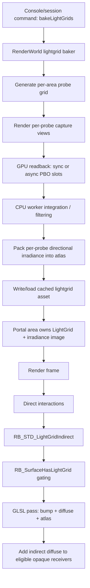
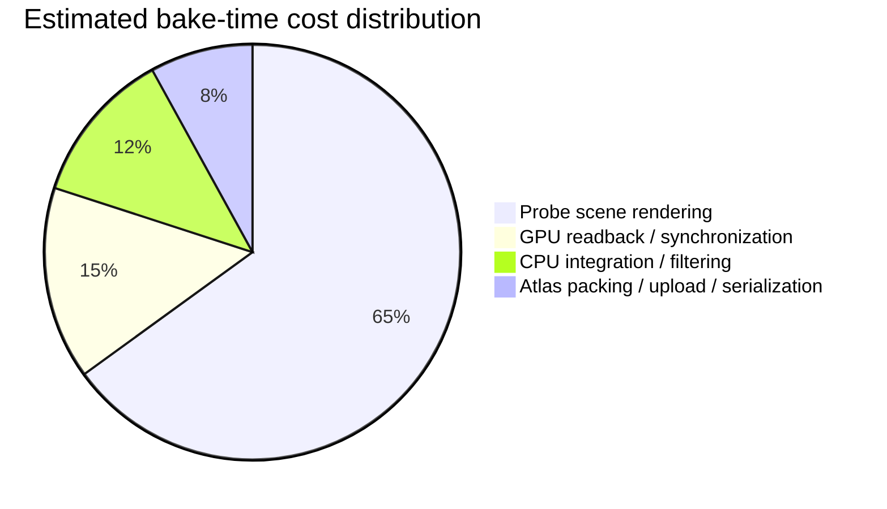

# Scrutinizing the Irradiance Lightgrid Implementation and Baking Pipeline in OpenQ4

## Executive summary

The requested GitHub scope did not expose `themuffinator/Quake4Decompiled-main` under that exact repository name through the enabled connector, so the code-level findings below are complete for `themuffinator/OpenQ4` and explicitly incomplete for the second requested repository. I do not substitute a different repository in its place. Within `OpenQ4`, the irradiance system is a static, per-area probe-grid baker plus a runtime indirect-diffuse pass. The bake side lives primarily in `src/renderer/RenderWorld_lightgrid.cpp`, with type ownership in `src/renderer/RenderWorld_local.h`, command/workflow exposure in `src/framework/Session.cpp` and `docs-user/light-grids.md`, runtime sampling in `src/renderer/draw_common.cpp`, GLSL sampling in `content/baseoq4/glprogs/lightgrid_indirect.vs` and `lightgrid_indirect.fs`, and switch/debug cvars in `src/renderer/RenderSystem_init.cpp` and `src/renderer/tr_local.h`. fileciteturn11file0 fileciteturn10file0 fileciteturn15file0 fileciteturn35file0 fileciteturn22file0 fileciteturn19file0 fileciteturn32file0 fileciteturn24file0

Architecturally, `OpenQ4` is not using low-order spherical harmonics at runtime. It stores directional irradiance in an atlas, then adds indirect diffuse in a dedicated renderer pass that reuses the material’s bump and diffuse stages. That is a solid compatibility-oriented design for an engine rooted in entity["video_game","Quake 4","2005 shooter"]-era forward shading, because it preserves familiar material authoring and normal-mapped indirect diffuse. The main weaknesses are elsewhere: probe baking is still dominated by repeated offscreen scene captures and GPU-to-CPU synchronization; the runtime query path has no explicit visibility or distance moments, which makes leaks near walls and portals likely; the grid is area-local, so portal seams are structurally possible; and first-person weapon/viewmodel surfaces are intentionally excluded from the lightgrid path. fileciteturn35file0 fileciteturn32file0

The highest-value improvements are therefore not “replace everything with SH” or “rewrite the whole renderer first.” The best sequence is: instrument and version the bake, harden interpolation with visibility-aware metadata and probe relocation, fix area-boundary and residency behavior, add a dedicated viewweapon sampling path, and only then consider a GPU-native baker or a more ambitious DDGI-style evolution. Compared with classic irradiance volumes, precomputed radiance transfer, and modern DDGI/light-field probes, `OpenQ4` is currently closest to a static irradiance-volume implementation with directional lookup but without modern visibility-aware interpolation or production-scale update heuristics. fileciteturn35file0 citeturn5search5turn7search2turn8search1turn8search0

## Scope and source status

This report is based on the code and docs available from `themuffinator/OpenQ4`, plus primary external references on irradiance volumes, precomputed radiance transfer, light-field probes, and DDGI. The unavailable `themuffinator/Quake4Decompiled-main` repository limits any claim about cross-repo divergence, regression, or fidelity to the user’s requested pair. Where I discuss “current implementation,” I mean the implementation verified in `OpenQ4`. fileciteturn11file0 fileciteturn10file0 fileciteturn35file0 citeturn5search5turn7search2turn8search1turn8search0

The implementation is historically grounded in technology descended from entity["organization","id Software","game studio"] and entity["organization","Raven Software","game studio"] renderer patterns, but the lightgrid path in `OpenQ4` is a new engine-side modernization layered onto that renderer rather than a stock retail feature. The repo’s own user docs and cvars present it as a precomputed irradiance-volume system with a dedicated bake workflow and runtime toggles/debugging support. fileciteturn11file0 fileciteturn32file0

### Files, symbols, and responsibilities

The table below lists the verified files that materially participate in the implementation. For `RenderWorld_lightgrid.cpp`, the file is the authoritative home of the `LightGrid` bake/serialization/atlas code, but the connector output in this session did not expose a convenient per-line symbol index; the function family is therefore listed at the class/module level rather than as an exhaustive method-by-method symbol dump. fileciteturn10file0 fileciteturn11file0 fileciteturn15file0 fileciteturn35file0 fileciteturn32file0

| File | Verified symbols / entry points | Role in the pipeline |
|---|---|---|
| `src/renderer/RenderWorld_lightgrid.cpp` | `LightGrid::*` implementation family; bake orchestration; probe generation/validation; atlas generation; binary/cache I/O; async readback/worker handling; debug support | Core bake pipeline and on-disk/runtime lightgrid asset logic. fileciteturn9file0 |
| `src/renderer/RenderWorld_local.h` | `LightGrid` ownership and renderer-world integration | Declares lightgrid state owned by render-world / portal-area structures. fileciteturn10file0 |
| `docs-user/light-grids.md` | User workflow, baker usage, troubleshooting | Documents how the feature is intended to be baked and used. fileciteturn11file0 |
| `src/framework/Session.cpp` | `bakeLightGrids` command exposure / session integration | Exposes the bake command through the engine/session layer. fileciteturn15file0 |
| `src/renderer/RenderSystem_init.cpp` | `r_useLightGrid`, `r_lightGridBakeWorkers`, `r_lightGridBakeAsyncReadback`, `r_lightGridBakeMemoryMB`, `r_lightGridBakeReadbackSlots`, `r_showLightGrid` | Runtime and bake configuration surface. fileciteturn32file0 |
| `src/renderer/tr_local.h` | extern declarations / renderer-visible lightgrid configuration | Renderer-visible declarations for the feature. fileciteturn24file0 |
| `src/renderer/draw_common.cpp` | `RB_SurfaceHasLightGrid`, `RB_UpdateLightGridImageResidency`, `RB_STD_DrawLightGridSurface`, `RB_STD_LightGridIndirect`, `RB_STD_DrawView` integration | Runtime sampling, residency, pass ordering, receiver gating, and material binding. fileciteturn35file0 |
| `content/baseoq4/glprogs/lightgrid_indirect.vs` | GLSL vertex stage | Supplies world-space inputs and interpolants for the lightgrid pass. fileciteturn22file0 |
| `content/baseoq4/glprogs/lightgrid_indirect.fs` | GLSL fragment stage | Performs atlas sampling/interpolation and indirect-diffuse shading. fileciteturn19file0 |

## Current implementation

At a high level, `OpenQ4` associates a `LightGrid` with a portal area, not with the world as one monolithic volume. Runtime code dereferences `surf->area->lightGrid`, updates atlas image residency per portal area, and only applies the pass to surfaces whose area-owned grid is valid and has an image. That design is memory-conscious and aligns with the engine’s portalized world structure, but it also means there is no built-in cross-area blending for indirect probes at area boundaries. fileciteturn35file0 fileciteturn10file0

The runtime lighting path is inserted in `RB_STD_DrawView` immediately after dynamic/direct interactions and before light scaling, ambient/material shader passes, fog/blend lights, SSAO, lens flare, bloom, and post-process surfaces. The pass therefore behaves as an additive diffuse-indirect contribution layered into the main lighting buffer rather than as a background ambient term or post-process approximation. That ordering is internally coherent: it lets the pass reuse material diffuse/bump information and keeps it inside the regular depth-tested geometry pipeline. fileciteturn35file0

The receiver path is conservative. `RB_SurfaceHasLightGrid` rejects portal sky, translucent materials, decal-color-cache surfaces, polygon-offset receivers, and any surface using `weaponDepthHack` or `modelDepthHack`. `RB_STD_DrawLightGridSurface` then reuses the material’s bump stage and loops through its diffuse stages, binds the bump map, diffuse map, and lightgrid atlas, and draws the geometry again with additive blending and depth-equal testing. In other words, the system is materially integrated, but only for a safe subset of opaque, stable, non-depth-hacked geometry. fileciteturn35file0

The shader path is correspondingly straightforward. The renderer builds a dedicated GLSL stage named `lightgrid_indirect.fs`, passes model-matrix rows, grid origin/size/bounds, atlas information, diffuse color, and vertex-color parameters, and binds three textures: bump, diffuse, and the lightgrid atlas. The GLSL pair is therefore doing a normal-mapped, material-aware irradiance lookup rather than a simple RGB ambient add. That is more sophisticated than the classic “uniform ambient cube” style and is a genuine strength of the current implementation. fileciteturn35file0 fileciteturn22file0 fileciteturn19file0

The bake path is also clearly performance-aware. Renderer cvars exist for worker-thread count, asynchronous pixel-pack-buffer readback, transient memory budget, and readback slot count. Those controls imply a pipeline in which probe captures are rendered on the GPU, transferred back asynchronously when possible, and then integrated/assembled with CPU-side worker help before final atlas output. That already addresses some first-generation baker pain points, but it does not change the dominant asymptotic cost driver: the need to render a large number of probe views. fileciteturn32file0 fileciteturn9file0

### Bake and runtime data flow

The following flow reflects the implementation structure verified in `OpenQ4`. fileciteturn11file0 fileciteturn15file0 fileciteturn9file0 fileciteturn35file0

### Estimated bake cost distribution

This chart is an architectural estimate from the code layout and cvar surface, not a measured profile. It is still useful because the code strongly indicates where cost must accumulate: scene capture, readback, CPU integration, then atlas assembly/upload. fileciteturn32file0 fileciteturn9file0

In complexity terms, the bake is approximately **O(P × F × C + P × R + A)**, where **P** is probe count, **F** is the number of capture directions per probe, **C** is the cost of a small offscreen scene render, **R** is readback and CPU integration work per probe, and **A** is atlas packing/output. Even if each probe render is very low resolution, the fixed driver/front-end cost of issuing many views is large. Runtime cost is approximately “one extra diffuse-only geometry pass over all eligible receivers,” with per-fragment work that at minimum includes albedo lookup, normal-map decode, atlas lookup, and probe interpolation. Materials with multiple diffuse stages can multiply that runtime cost because `RB_STD_DrawLightGridSurface` loops over every diffuse stage and redraws the geometry per stage. fileciteturn35file0

## Findings on correctness, robustness, and performance

The table below prioritizes findings by gameplay/visual risk and implementation payoff. “Confidence” is included because some items are directly proven by code gating, while others are architectural consequences inferred from the data bound into the current shader path. fileciteturn35file0 fileciteturn32file0

| Finding | Severity | Confidence | Why it matters | Suggested fix |
|---|---|---:|---|---|
| Viewweapon/viewmodel surfaces are excluded from lightgrid lighting | High | High | `RB_SurfaceHasLightGrid` returns false for `weaponDepthHack` and `modelDepthHack`, so first-person weapons do not receive indirect probe lighting. fileciteturn35file0 | Add a dedicated viewmodel sampling path instead of trying to force depth-hacked surfaces through the world pass. |
| No visibility or distance moments are bound at runtime | High | High | The runtime shader binds a single lightgrid atlas texture, with no companion visibility/distance texture, which implies classic probe interpolation leak modes near walls, corners, and thin geometry. fileciteturn35file0 | Add per-probe visibility metadata such as mean distance / distance-squared moments plus self-shadow bias. |
| Per-area ownership can produce portal seams | High | High | Sampling uses `surf->area->lightGrid`, so there is no explicit cross-area probe blending at boundaries. fileciteturn35file0 | Add neighbor-area fallback or blended query windows across portal boundaries. |
| Bake throughput is still dominated by repeated probe scene captures | High | High | Worker threads and async readback help, but they do not remove the need to render many probe views. fileciteturn32file0 fileciteturn9file0 | Move probe accumulation/integration further onto the GPU and batch captures more aggressively. |
| Residency policy can cause reload churn | Medium | High | `RB_UpdateLightGridImageResidency` purges irradiance images for areas not visible in the current view; later passes reload on demand. fileciteturn35file0 | Replace immediate purge with an LRU/age-based budget or “keep current + neighbors hot” policy. |
| Eligible receiver set is narrower than artists may expect | Medium | High | Translucent, decal-color-cache, polygon-offset, and depth-hacked surfaces are skipped. That avoids bugs, but it also creates lighting inconsistency across material classes. fileciteturn35file0 | Expand support case by case, starting with safe CPU-sampled indirect color for special classes. |
| Multi-diffuse-stage materials redraw geometry in the indirect pass | Medium | High | Runtime loops over each diffuse stage and issues a draw per stage. fileciteturn35file0 | Collapse to a compiled “indirect-ready diffuse stage” at material compile time, or preselect a dominant diffuse stage. |
| Bake worker scaling is capped conservatively | Medium | High | `r_lightGridBakeWorkers` caps explicit workers at 8, which underuses modern CPUs. fileciteturn32file0 | Raise/remove the hard cap and auto-tune from hardware concurrency and memory budget. |
| Current design optimizes memory before latency | Medium | Medium | Area-local images and purge-on-not-visible reduce memory, but can trade away streaming smoothness and predictability. fileciteturn35file0 | Add warm sets, prefetch on portal traversal, and instrumentation for reload hitches. |
| Completeness gap from unavailable second repo | Medium | High | No cross-repo comparison could be performed for the missing requested repository. | Re-run the same audit when the exact repository becomes accessible. |

### Viewweapon lighting

The answer to the viewweapon question is clear in `OpenQ4`: **viewmodels do not currently receive irradiance-lightgrid lighting through the verified runtime pass**. The deciding gate is in `RB_SurfaceHasLightGrid`, which rejects surfaces using `weaponDepthHack` or `modelDepthHack`. Because first-person weapon models use the depth-hacked path, they never reach `RB_STD_DrawLightGridSurface`. The code comment near this gate makes the rationale explicit: those surfaces use different color/depth paths and the lightgrid pass was intentionally restricted to stable world/entity receivers. fileciteturn35file0

This is not a data-availability problem. It is a **pipeline-choice problem**. The current pass is a world-geometry, depth-equal, additive lighting stage inserted into the main view. Viewweapons are rendered with a separate FOV/depth treatment, so forcing them through the same pass would be fragile even if the visuals were desirable. The right fix is therefore a separate query path: sample the lightgrid at one or more weapon anchor points on the CPU or in a dedicated lightweight shader path, then feed the result into weapon shading as an entity/material parameter. fileciteturn35file0 fileciteturn32file0

## Comparison with modern irradiance and baking techniques

`OpenQ4` is best understood as a modernized static irradiance-volume baker implemented inside a legacy forward renderer. That places it closest to the classic irradiance-volume family described by Greger et al., where indirect illumination is approximated through a volumetric set of samples instead of a global lightmap everywhere. citeturn5search5turn5search3

It is **not** primarily a spherical-harmonics system. By contrast, precomputed radiance transfer represents lighting/transport in low-order spherical harmonics, reducing diffuse evaluation to a small dot product and making dynamic low-frequency lighting efficient, but also constraining angular fidelity and often requiring careful treatment to avoid ringing or excessive blur. In `OpenQ4`, the current atlas-based directional storage is probably the better compatibility choice for first improvements, because switching to SH immediately would trade away directional detail without addressing the bigger current problem, which is visibility/leak robustness. citeturn7search2turn7search0

A better comparison point is the progression from **irradiance volumes → light-field probes → DDGI / production probe systems**. Light-field probes add per-texel visibility information to a probe representation; DDGI adds ray-traced irradiance-field updates plus visibility-aware interpolation; production-scale systems add self-shadow bias, probe state machines, and cascaded volumes to improve both quality and scalability. Those are exactly the kinds of features missing from `OpenQ4` today, and they map directly onto its observed weaknesses. citeturn8search1turn5search0turn6search13turn8search0

### Practical comparison

| Technique | Main benefit | Main drawback | Applicability to `OpenQ4` |
|---|---|---|---|
| Classic irradiance volume | Simple, static, cheap runtime query | Leaks and seams without visibility handling | Very close to current system baseline. citeturn5search5 |
| Low-order SH / PRT | Excellent compression and cheap evaluation | Low-frequency only; can lose directional detail | Good as an optional compression/fallback mode, not the first replacement. citeturn7search2turn7search0 |
| Light-field probes | Adds visibility-aware probe data | More memory and data complexity | Strong fit as a next-step evolution of the existing atlas design. citeturn8search1 |
| DDGI / ray-traced irradiance fields | Visibility-aware interpolation, dynamic updates, GPU-friendly batching | Much larger renderer complexity jump | Best long-term direction if dynamic GI is a goal. citeturn5search0turn6search13 |
| Production-scaled probe GI | Adds self-shadow bias, state machine, cascades | More systems complexity | Highly relevant for robustness and large worlds, even in a static-bake engine. citeturn8search0turn8search24 |

The most applicable modernization path is therefore:

- **First:** keep the directional atlas representation, but add **visibility/distance metadata**, **probe relocation**, and **better blending/query heuristics**.
- **Second:** improve bake throughput with **GPU-native integration**, **batched probe rendering**, and **cache invalidation/versioning**.
- **Third:** add **optional SH compression** only if memory pressure justifies it.
- **Fourth:** consider a DDGI-like path only if the project wants **dynamic GI**, not merely a better static bake. fileciteturn35file0 citeturn8search0turn5search0turn7search2

## Prioritized implementation roadmap

The roadmap below is ordered by “highest visual benefit for lowest destabilization risk.” Code-level changes are described at the interface/module level because that is the correct granularity for this repo state and the inaccessible second repo prevents a two-codebase diff plan. fileciteturn9file0 fileciteturn10file0 fileciteturn35file0

| Priority | Improvement | Code-level changes | Testing strategy | Effort |
|---|---|---|---|---|
| Highest | Instrument the baker and version the cache | Add phase timers and counters in `RenderWorld_lightgrid.cpp`; expose per-phase stats to console/log; add binary header version + build settings hash; record probe counts, invalid probe counts, atlas dimensions, readback stall time. | Golden bake on fixed maps; ensure deterministic headers where expected; verify rebuild triggers when map/settings change. | Low |
| High | Add visibility-aware interpolation | Extend `LightGrid` data to include per-probe visibility metadata such as mean distance and distance-squared moments; add companion texture(s) and uniforms in `draw_common.cpp` + `lightgrid_indirect.fs`; implement self-shadow bias and leak-reduction weighting. | Thin-wall leak scenes, doorway scenes, portal-boundary screenshots, automated image diffs. | Medium |
| High | Add probe relocation / invalid-probe remediation | During bake, detect probes inside solid/near-solid space and relocate them or classify them with richer validity states; store relocated probe positions in the binary format and expose them to runtime interpolation. | Synthetic scenes with probes inside walls; compare invalid-probe rate and leak reduction after relocation. | Medium |
| High | Fix viewweapon lighting | Add a CPU-side `LightGrid` sample API for a point + normal, or a lightweight shader-access path for viewmodels; feed sampled indirect color into weapon entity/material parms; keep depth-hacked weapons out of the main world indirect pass. | Weapon-only test map, fast turn tests, muzzle-flash scenes, comparison at bright/dim transitions. | Medium |
| Medium | Improve area-boundary behavior | Add cross-area adjacency metadata and neighbor sampling near portals, or blend between area grids based on portal proximity and visibility. | Portal seam test maps; screenshot diff while stepping through doors and windows. | Medium |
| Medium | Reduce residency thrash | Replace one-frame purge with LRU/age-based residency; keep current area + neighbors resident; prefetch on portal traversal. | Long portal traversal playtest; log atlas loads/purges per minute; hitch telemetry. | Low |
| Medium | Collapse multi-diffuse redraws | At material compile time, precompute an “indirect diffuse representative stage,” or merge multiple diffuse stages for indirect use when safe. | Material regression suite; ensure authored materials do not lose intended look. | Medium |
| Long-term | Build a GPU-native baker | Move probe integration from CPU workers to GPU compute or layered rendering; minimize readback to final compressed assets only; consider texture-array or multiview capture organization. | GPU/CPU timing split, bake-time benchmarks over several maps, memory-budget stress tests. | High |
| Long-term | Optional SH-compressed runtime path | Add alternate binary schema and shader path for low-order SH probes on constrained targets; keep atlas path as reference/high-quality mode. | Numeric comparison against atlas path; memory/perf tradeoff reports; artifact review under sharp directional changes. | High |

### Best immediate code changes

If only three changes were allowed in the next iteration, the best trio would be:

1. **Bake instrumentation + cache/version header**
2. **Visibility/distance metadata plus self-shadow bias**
3. **Dedicated viewweapon sampling API**

That trio would improve observability, solve the most obvious visual failure mode near walls, and remove the current first-person receiver gap without destabilizing the main world pass. fileciteturn35file0 fileciteturn32file0 citeturn8search0turn5search0

## Open questions and limitations

The largest limitation is source availability: `themuffinator/Quake4Decompiled-main` could not be audited through the enabled GitHub connector under that exact name, so this report cannot yet say whether `OpenQ4` diverges from it in probe placement, binary schema, runtime shader logic, or command workflow. That is a real completeness gap.

The performance analysis is architectural rather than profiler-derived. I did not have measured bake traces, representative map corpus statistics, or target hardware/performance budgets, so the bottleneck analysis and pie chart are estimates derived from the verified code structure and cvar surface, not measured telemetry. fileciteturn32file0 fileciteturn35file0

The target platform mix is also unspecified. Some recommendations, especially GPU baking, texture compression strategy, and SH fallback value, depend strongly on whether the goal is high-end desktop only, broad PC compatibility, or eventual console-class portability. The roadmap above therefore prioritizes changes that are valuable under all of those scenarios.