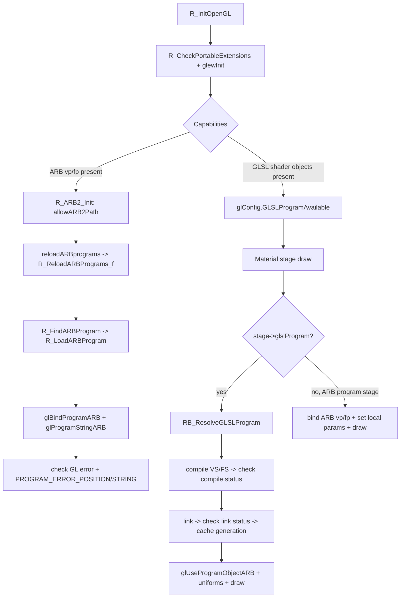

# ARB2 Shader Compilation Robustness and Failure Modes in OpenQ4

## Executive summary

OpenQ4’s “ARB2” renderer uses two related shader technologies: ARB assembly programs (via `GL_ARB_vertex_program` / `GL_ARB_fragment_program`) and GLSL programs using the legacy ARB shader object API (`GL_ARB_shader_objects`). The codebase already contains strong building blocks for robustness in the GLSL path—most notably a disciplined “load → compile → status-check → link → status-check → cache-by-context-generation” pattern and consistent info-log reporting—while the ARB assembly program path is comparatively permissive and can fail “softly” in ways that later surface as confusing runtime GL errors or rendering corruption. fileciteturn78file0L1-L1 fileciteturn83file0L1-L1

Key robustness gaps and failure modes concentrate around (a) incomplete state tracking for ARB assembly program validity (compile failures don’t clearly disable later use), (b) diagnostic suppression by default (`r_ignoreGLErrors` defaults to ignoring), (c) loader/extension-string assumptions that may not hold across modern core contexts, and (d) lack of persistent shader caching (disk/binary caching) for GLSL programs. fileciteturn79file0L1-L1 fileciteturn83file0L1-L1

Modernization should be approached as an incremental hardening + developer UX initiative: unify shader compilation into a single “shader manager” with explicit validity states and structured error payloads; adopt modern diagnostics (`KHR_debug`), robust reset handling (`KHR_robustness`), and optional parallel/async compile (`KHR_parallel_shader_compile`); add a persistent cache guarded by strict compatibility keys and known driver quirks; and invest in reproducible shader-compile tests and runtime metrics. citeturn15search0turn0search1turn18search0

## Code-level pipeline and API entry points in OpenQ4 and OpenQ4-GameLibs

This section maps the *actual* shader compilation/loading pipeline as implemented in the two requested repos at commit `738afb3…` (OpenQ4) and `b10475d…` (OpenQ4-GameLibs). fileciteturn79file0L1-L1 fileciteturn80file0L1-L1

### Capability detection and top-level entry points

OpenQ4 decides whether the ARB2 and GLSL paths are available during OpenGL initialization in `src/renderer/RenderSystem_init.cpp`:

- Extension gating is primarily **string-based** (`R_CheckExtension` checks `glConfig.extensions_string`) and is executed after `glewInit()` in `R_CheckPortableExtensions()`. This populates key booleans such as `glConfig.ARBVertexProgramAvailable`, `glConfig.ARBFragmentProgramAvailable` (can be inhibited by `r_inhibitFragmentProgram`), and `glConfig.GLSLProgramAvailable` (requires `GL_ARB_shader_objects`, `GL_ARB_vertex_shader`, `GL_ARB_fragment_shader`, `GL_ARB_shading_language_100`). fileciteturn79file0L1-L1

- The “ARB2 path” gets enabled/disabled at a high level by calling `R_ARB2_Init()` during `R_InitOpenGL()`, followed immediately by registering and executing the command `reloadARBprograms` (calls `R_ReloadARBPrograms_f`). fileciteturn79file0L1-L1

- Global GL error reporting exists via `GL_CheckErrors()`, but it only prints when `r_ignoreGLErrors` is **false**; the default is `"1"` (ignore). This is a major developer-UX/diagnostics tradeoff: fewer stalls and less spam, but failures become silent unless the user explicitly enables error reporting. fileciteturn79file0L1-L1

### Extension function entry points and loader interactions

In OpenQ4-GameLibs, `src/renderer/qgl.h` declares the ARB2 and ARB shader object function entry points used throughout OpenQ4:

- ARB assembly program API: `qglProgramStringARB`, `qglBindProgramARB`, `qglGenProgramsARB`, and the parameter APIs (`qglProgramEnvParameter4fvARB`, `qglProgramLocalParameter4fvARB`). fileciteturn80file0L1-L1

- ARB shader objects (GLSL-era) API: `qglCreateShaderObjectARB`, `qglShaderSourceARB`, `qglCompileShaderARB`, `qglGetObjectParameterivARB`, `qglGetInfoLogARB`, `qglCreateProgramObjectARB`, `qglAttachObjectARB`, `qglLinkProgramARB`, `qglUseProgramObjectARB`, `qglGetUniformLocationARB`, and `qglUniform*ARB`. fileciteturn80file0L1-L1

- Platform differences: on Apple or when hardlinking (`__APPLE__` or `ID_GL_HARDLINK`) the `qgl*` calls are redirected to directly linked GL symbols; otherwise (notably Windows) they are function pointers to support logging intercepts. The existence of multiple loader paths means robustness improvements should include **null-pointer checks** (or centralized loader validation) and **consistent capability checks** that consider both extension exposure and function pointer availability. fileciteturn80file0L1-L1

On macOS, `GLimp_ExtensionPointer` is implemented in `src/sys/osx/macosx_glimp.mm` using symbol lookup (not `glXGetProcAddress`/`wglGetProcAddress` in the usual sense), and the file shows additional debug-only error interception (`QGLCheckError`) that throttles output after 100 errors. fileciteturn81file0L1-L1

image_group{"layout":"carousel","aspect_ratio":"16:9","query":["OpenGL shader compilation pipeline diagram","OpenGL program object linking diagram","GLSL compile link validate flowchart"],"num_per_query":1}

### ARB2 assembly program pipeline (ARBvp/ARBfp)

The ARB assembly program pipeline lives primarily in `src/renderer/draw_arb2.cpp`:

- **Program discovery and caching**: `R_FindARBProgram(GLenum target, const char *programName)` searches a fixed-size table (`MAX_GLPROGS`, 200) and loads a program if missing. Hitting the limit triggers an error (“MAX_GLPROGS”). fileciteturn78file0L1-L1

- **Reload command**: `R_ReloadARBPrograms_f` iterates all loaded programs and reloads them from disk; this is wired to the `reloadARBprograms` console command and is run once at init. fileciteturn79file0L1-L1 fileciteturn78file0L1-L1

- **Compilation / upload**: `R_LoadARBProgram(int progIndex)`:
  - Loads the text from `progs[progIndex].name` using `fileSystem->ReadFile`.
  - Identifies whether the file contains a vertex (`!!ARBvp`) or fragment (`!!ARBfp`) program header and finds the terminating `END`.
  - Calls `glBindProgramARB` + `glProgramStringARB` with the substring starting at the `!!ARB*` header.
  - Uses `glGetError` and reads `GL_PROGRAM_ERROR_POSITION_ARB`; when `GL_INVALID_OPERATION` occurs, it prints the driver-reported `GL_PROGRAM_ERROR_STRING_ARB` and the error position. fileciteturn78file0L1-L1

- **ARB2 enablement**: `R_ARB2_Init()` sets `glConfig.allowARB2Path` based on availability of `GL_ARB_vertex_program` and `GL_ARB_fragment_program`. It does not, by itself, compile a “known good” probe program at init to validate end-to-end driver support. fileciteturn78file0L1-L1 fileciteturn79file0L1-L1

**Robustness implication:** the ARB assembly loader prints errors but (as written) does not establish a strongly enforced “invalid program cannot be bound/enabled later” contract in the same way the GLSL code does (with `glslProgramLoaded` / `glslProgramValid`). The ARB program specs indicate that using an invalid current vertex program while vertex program mode is enabled can trigger `GL_INVALID_OPERATION` at draw-time. citeturn10search0

### GLSL pipeline in OpenQ4 (ARB shader objects)

OpenQ4 has two distinct GLSL compilation loci (both using ARB shader object APIs):

1) **General “new stage” GLSL programs** for materials/post-process, implemented in `src/renderer/draw_common.cpp`:
- Programs are tracked per `newShaderStage_t` with fields such as `glslProgramLoaded`, `glslProgramValid`, `glslProgramGeneration`, and shader/program object IDs.
- `RB_ResolveGLSLProgram(newShaderStage_t *stage)` is the primary compilation entry point:
  - If GLSL is unavailable, it marks the stage loaded but invalid (fast-fail, avoids repeated attempts).
  - If already loaded for the current `tr.videoRestartCount`, returns cached validity.
  - Otherwise: frees any prior objects (`RB_FreeGLSLProgram`), finds paired source files (`RB_FindGLSLSourcePair`), compiles vertex+fragment, checks `GL_OBJECT_COMPILE_STATUS_ARB`, links and checks `GL_OBJECT_LINK_STATUS_ARB`, stores uniform locations, sets `glslProgramGeneration = tr.videoRestartCount`, and prints a “Loaded GLSL program …” line. fileciteturn83file0L1-L1

- Info logs are handled uniformly through `RB_PrintGLSLInfoLog`, which reads `GL_OBJECT_INFO_LOG_LENGTH_ARB` and prints the log (or warns “no info log”). fileciteturn83file0L1-L1

- `RB_STD_T_RenderShaderPasses` shows how GLSL-backed stages are executed:
  - `glUseProgramObjectARB(stage->glslProgramObject)`
  - per-uniform setting via `glUniform{1,2,3,4}fvARB` based on stage metadata
  - per-texture binding on texture units and sampler assignment via `glUniform1iARB`
  - cleanup: unbind extra texture units, `glUseProgramObjectARB(0)`, disable client state as needed. fileciteturn83file0L1-L1

2) **Shadow-map GLSL programs** inside `src/renderer/draw_arb2.cpp` (used when `r_useShadowMap` is enabled):
- The loader functions (`RB_ShadowMapLoadProgram`, `RB_PointShadowMapLoadProgram`, `RB_PointShadowMapLoadCasterProgram`) follow the same compile/link/status pattern and cache by `programGeneration == tr.videoRestartCount`, avoiding recompilation across frames and rebuilding after `vid_restart`. fileciteturn78file0L1-L1 fileciteturn79file0L1-L1

### Fallback paths already present

OpenQ4’s material pipeline contains multiple fallback ideas that are directly relevant to “robust shader handling”:

- If a material stage is flagged `glslProgram` but GLSL isn’t available, `RB_ResolveGLSLProgram` marks it loaded/invalid so subsequent draws skip it without repeatedly attempting compilation. fileciteturn83file0L1-L1

- Shadow maps: the code explicitly contains logic to fall back (at runtime) from shadow-map rendering to the traditional stencil shadow pipeline if the shadow map pass fails. fileciteturn78file0L1-L1

- Post-process ordering: the renderer copies `_currentRender` only when needed for post-process materials, and also includes a fallback copy if a material unexpectedly references `_currentRender` outside the expected sorting path. This is a non-shader example of “robustness via redundancy,” and the pattern generalizes to shader compilation caching and fallback. fileciteturn83file0L1-L1

## Robustness analysis and failure modes

### Driver-facing parsing and compilation behavior

**ARB assembly (glProgramStringARB) parser constraints** are largely driver-defined and specified in the ARB program extensions:
- The program string includes a required `!!ARBvp*` / `!!ARBfp*` header and uses `#` for comments; syntax errors and semantic errors during `ProgramStringARB` upload are reported via `GL_PROGRAM_ERROR_POSITION_ARB` and `GL_PROGRAM_ERROR_STRING_ARB`. citeturn9search0turn10search0
- The spec notes that draw-time behavior can fail if vertex program mode is enabled with an invalid/missing current program, producing runtime GL errors rather than a clear “compile failed” message at load time. citeturn10search0

**GLSL (ARB_shader_objects) behavior**:
- Compilation and link errors are detectable via `GL_OBJECT_COMPILE_STATUS_ARB`, `GL_OBJECT_LINK_STATUS_ARB`, and info logs obtainable through `glGetInfoLogARB`. citeturn11search0
- OpenQ4’s `RB_PrintGLSLInfoLog` and `RB_ResolveGLSLProgram` map cleanly to that model and provide a strong template to generalize (including for ARB assembly, where possible). fileciteturn83file0L1-L1

### Comparative failure-mode table

The table below focuses on *robustness and failure handling* across ARB assembly and GLSL paths, and on how failures propagate into runtime rendering.

| Failure mode | Likely root cause | How it manifests in OpenQ4 today | Detection method | Mitigation / modernization |
|---|---|---|---|---|
| ARB program file missing | Bad install, mod packaging, wrong case/path | `R_LoadARBProgram` prints missing file and returns; later render path may still assume program exists | `fileSystem->ReadFile` failure; logs | Track `valid=false` per program, disable binding/enabling; fallback to non-ARB2 path or skip effect; add “compile-all at init” option fileciteturn78file0L1-L1 |
| ARB program missing `!!ARBvp/!!ARBfp` header or `END` | Content corruption, authoring error | Loader prints “couldn’t find header/END” and returns | string search in loader | Use stricter structural validation + include snippet in log; treat as *hard invalid* for that feature, not “best-effort” fileciteturn78file0L1-L1 |
| `glProgramStringARB` fails with `GL_INVALID_OPERATION` | Syntax/semantic error, resource limits, driver bug | Error string/position printed; program validity not clearly tracked afterward | `glGetError`, `GL_PROGRAM_ERROR_POSITION_ARB`, `GL_PROGRAM_ERROR_STRING_ARB` | Store full error payload, mark program invalid, and ensure later draws never enable invalid programs; optionally auto-disable ARB2 or downgrade renderer fileciteturn78file0L1-L1 citeturn9search0turn10search0 |
| Runtime GL errors because invalid program is enabled | Program load partially failed but render path still enables it | Visual corruption, black surfaces, “random” GL errors; often suppressed by default | `GL_CheckErrors` only prints when `r_ignoreGLErrors=0` | Add internal “guard rails”: `if (!prog.valid) { fallback }` and structured logging; reduce reliance on `glGetError` polling in shipping builds fileciteturn79file0L1-L1 |
| GLSL stage cannot find paired `.vs`/`.fs` sources | Authoring mismatch, wrong filename extension, missing pair | `RB_ResolveGLSLProgram` warns “Couldn't find GLSL sources…” and marks stage invalid | `RB_FindGLSLSourcePair` | This part is already robust; modernization: add “candidate list” to log + include resolved absolute path list for repro fileciteturn83file0L1-L1 |
| GLSL compile failure (vertex/fragment) | GLSL version mismatch, syntax error, unsupported features, driver bug | `RB_PrintGLSLInfoLog` prints compile log; stage invalidated and skipped | `GL_OBJECT_COMPILE_STATUS_ARB` + info log | Already good. Improve by adding source hashing + standardized prefix (`#version`, defines) + dump-to-file option for repro fileciteturn83file0L1-L1 citeturn11search0 |
| GLSL link failure | Interface mismatch, missing varyings/uniform mismatch, driver bug | Link log printed; stage invalidated | `GL_OBJECT_LINK_STATUS_ARB` + info log | Already good. Add optional `glValidateProgram` (or ARB equivalent) in dev builds and capture validation log fileciteturn83file0L1-L1 citeturn11search0 |
| Uniform location is -1 unexpectedly | Optimized-out uniform, name mismatch, wrong shader variant | Some uniforms guarded by `>=0`, others may be set anyway | `glGetUniformLocationARB` result | Normalize: always guard uniform updates by location >= 0; add a debug warning once per program for missing “required” uniforms fileciteturn83file0L1-L1 |
| `vid_restart` invalidates program objects | Context recreation, driver reset, device loss | OpenQ4 increments `tr.videoRestartCount`; GLSL stages and some shader programs cache by generation | `tr.videoRestartCount` checks | Extend the generation-cache pattern to ARB assembly and to any other GPU objects; unify under a single cache manager fileciteturn79file0L1-L1 fileciteturn83file0L1-L1 |
| Disk-level caching via program binaries breaks on some drivers | Binary formats vendor-specific; incompat with compat profiles; driver bugs | OpenQ4 currently does not use program binaries | N/A | If adding `ARB_get_program_binary`, guard with strict cache keying and opt-out lists; Mesa has history disabling program binaries for compatibility profiles in some cases citeturn18search0turn6search0 |
| GPU hang/reset during shader execution/compile | Driver/compiler bug; adversarial shader; heavy recursion | Potential crash/hang; hard to attribute | Robustness APIs (reset status) | Add optional robust context creation and poll `glGetGraphicsResetStatus`; on reset, invalidate caches and downgrade effects; tie to telemetry citeturn15search0turn8search5 |
| Adversarial shader causes DoS or memory corruption in driver/compiler | Vulnerable shader compiler path; excessive recursion; UAF | Out-of-process GPU compiler crash or system instability (depending on platform) | Security advisories/CVEs | Treat shader sources as untrusted inputs: rate-limit compilation, sandbox/priv-separate where feasible, consider disallowing “custom” shader ingestion in untrusted modes citeturn21search2turn20search0turn20search3 |

### Security and safety concerns

Shaders are a driver-facing “mini-program.” Multiple public advisories demonstrate that *crafted shader code* can be used to trigger denial-of-service (e.g., infinite recursion) or even memory safety issues in GPU drivers/compilers:

- An NVIDIA driver vulnerability (CVE-2018-6253) describes a specially crafted pixel shader causing infinite recursion and denial of service. citeturn21search2turn21search1
- CVE-2018-3979 describes a remote DoS scenario in the Nouveau driver triggered by a crafted pixel shader (in the cited reports, triggered through a browser rendering path). citeturn20search0turn20search6
- A much more recent record (CVE-2025-13952, published January 2026) describes a write/use-after-free crash in a GPU shader compiler library triggered by “unusual shader code,” with a note that privilege context of the compiler process can matter for exploitation. citeturn20search3

**Implication for OpenQ4:** even if content is “local,” mod ecosystems and downloadable content mean shader sources should be treated as potentially untrusted. Robust handling is not only about graceful graphics fallback; it also reduces the risk of shader-driven driver crashes and improves postmortem diagnosis when they happen.

### Performance impacts of robustness measures

OpenGL robustness and diagnostics often trade CPU/GPU overhead for observability:

- Repeated `glGetError` polling can stall the driver and is expensive in hot paths; OpenQ4 suppresses error reporting by default (via `r_ignoreGLErrors=1`) and limits `GL_CheckErrors` to a small bounded loop. fileciteturn79file0L1-L1
- Shader compilation and linking can be the biggest CPU hitch during level load or shader warm-up; OpenQ4’s GLSL stages cache compilation by `tr.videoRestartCount`, which is good but still lacks persistent caching across process launches. fileciteturn83file0L1-L1
- Adding `ARB_get_program_binary` caching can reduce compile time but introduces compatibility risks; real-world driver stacks have had significant issues around program binaries (including Mesa disabling aspects of it in some compatibility contexts). citeturn18search0turn6search0

## Modernization recommendations and implementation plan

### Prioritized actionable recommendations

**Priority: Critical (robust correctness + debuggability)**

1) **Unify shader compilation under a single “Shader Manager” abstraction with explicit validity states and structured error payloads.**  
   Mirror the GLSL pattern (`loaded`, `valid`, `generation`) for ARB assembly programs: every bind/enable should require `valid==true`, otherwise a deterministic fallback is chosen. This prevents the “compile failed earlier, crash later” class of failures. fileciteturn78file0L1-L1 fileciteturn83file0L1-L1 citeturn10search0

2) **Make error reporting actionable and reproducible.**  
   Keep `r_ignoreGLErrors` default for performance, but add targeted, *shader-specific* logs:
   - always print compile/link failures (already true for GLSL stages; make it true for ARB assembly too),
   - include: resolved file path, shader stage type, driver vendor/renderer/version, and a stable hash of shader source. fileciteturn79file0L1-L1 fileciteturn83file0L1-L1

3) **Adopt modern debug output when present (`KHR_debug`).**  
   Even while staying on legacy ARB APIs for compatibility, `KHR_debug` can dramatically improve UX by attaching object labels and receiving driver messages tied to shader/program objects (especially for link/validate warnings). (This is a Khronos best practice; implement opportunistically when available.) citeturn0search1

**Priority: High (robustness across drivers, reduced hitching)**

4) **Add optional parallel/async compile for GLSL programs.**  
   Implement an opt-in system that uses `KHR_parallel_shader_compile` when available and/or compiles programs on a background thread with a “deterministic fallback program” until compilation completes. The extension exists specifically to reduce stalls by enabling parallel compilation and allowing polling for completion status. citeturn0search1turn0search0

5) **Add persistent caching for GLSL programs—carefully.**  
   Use `ARB_get_program_binary` only when safe:
   - key binaries by (shader source hash, OpenQ4 build ID, GL_VENDOR/GL_RENDERER/GL_VERSION, driver version string, and binary format enum),
   - validate successful `glProgramBinary` by checking link status and optionally validating in dev builds,
   - implement a driver denylist / feature flag, because program binary support has historically been fragile in some stacks (example: Mesa has disabled program binary paths in some compatibility scenarios). citeturn6search0turn18search0

**Priority: Medium (safety and resilience)**

6) **Optional robust context + reset monitoring:**  
   When platform APIs allow it, create a robust context (EGL/WGL/GLX variants) and poll `glGetGraphicsResetStatus` periodically. On reset, invalidate shader caches, downgrade effects (disable shadow maps / post-process), and surface a clear message. citeturn15search0turn8search5

7) **Harden shader ingestion against adversarial content:**  
   For “untrusted content” modes (e.g., downloaded mods), consider:
   - limiting shader file sizes and number of variants,
   - timeboxing compilation work (soft watchdog),
   - disabling custom shader loading in multiplayer/competitive modes if applicable,
   - capturing a crash-safe “shader fingerprint” log for fast triage. This is justified by publicly documented shader-driven DoS/memory-safety bugs in drivers. citeturn21search2turn20search3turn20search0

### Task-level implementation plan and checklist

The plan below assumes unspecified platforms/drivers and is structured to minimize regression risk.

| Task | Owner | Effort | Dependencies | Tests | Rollout steps |
|---|---|---:|---|---|---|
| Implement `ShaderManager` core types (program record, validity flags, structured error payload) for **ARB assembly + GLSL** | Rendering engineer | 1–2 weeks | None | Unit-style tests for state transitions; compile smoke test | Land behind `r_shaderManager=1` toggle; ship disabled by default for one release |
| Add ARB assembly **validity tracking** and bind/enable guards | Rendering engineer | 3–5 days | ShaderManager core | ARBvp/ARBfp negative tests: missing header/END, syntax error | Enable by default in dev builds; keep fallback to old behavior behind a CVAR for emergency |
| Standardize error logging: file path, program name, shader hash, driver strings; add “dump failing shader source” option | Engine/tools engineer | 3–5 days | ShaderManager core | “golden” expected log formatting tests; regression integration | Roll out with log throttling; document in dev wiki |
| Add `KHR_debug` integration (labels for program objects + debug callback) | Rendering engineer | 1 week | GL loader exposes function pointers | Render test that asserts callback receives messages when forced errors occur | Default enabled in non-shipping; optional in shipping with sampling |
| Add async compile scaffolding (job queue + placeholder shaders) | Rendering + engine engineer | 2–4 weeks | ShaderManager + deterministic fallback shader | Frame-time hitches benchmark; correctness tests for placeholder swap | Enable only for post-process first; then shadow maps; then material stages |
| Implement disk cache format + safe cache keying; integrate `ARB_get_program_binary` feature gate | Rendering + platform engineer | 2–3 weeks | ShaderManager; filesystem interfaces | Cache hit/miss tests; compatibility tests; corrupt-cache tests | Roll out as opt-in (`r_shaderBinaryCache=1`); gather telemetry; expand |
| Add robust reset monitoring (`glGetGraphicsResetStatus`) + recovery policy | Platform/renderer engineer | 1–2 weeks | Robust context creation path | Simulated reset handling tests (where feasible); watchdog test harness | Ship disabled by default; enable on platforms with stable support |
| Security hardening: shader size limits, compilation rate limits, “untrusted-content mode” | Engine/security-minded engineer | 1 week | ShaderManager | Fuzz-ish shader input parser tests; perf tests | Ship enabled in “safe mode”; document as compatibility option |

## Suggested tests and monitoring metrics

### Tests for robustness and reproducibility

1) **Deterministic shader compile test suite (headless or minimal window):**
   - Compile every ARB assembly program referenced by the ARB2 path via the same loader (`R_FindARBProgram`/`R_LoadARBProgram`) and assert a validated “valid/invalid + error payload” result. fileciteturn78file0L1-L1
   - Compile every GLSL stage program `newShaderStage_t::glslProgramName` resolved by `RB_FindGLSLSourcePair` and assert compilation/link status plus stable logging on failure. fileciteturn83file0L1-L1

2) **Negative test corpus (small, versioned):**
   - ARBfp: missing `END`, invalid opcode, too many temporaries, illegal swizzle.
   - GLSL: syntax errors, link interface mismatch, missing required uniform, unsupported `#version`.
   Each should produce a **stable**, parseable failure payload (not just a console spew).

3) **Cross-context restart tests:**
   - Automated `vid_restart` loop (full and partial) validating that program generation / cache invalidation works and that no stale object IDs are used. fileciteturn79file0L1-L1 fileciteturn83file0L1-L1

4) **Driver matrix smoke tests (CI runners, where possible):**
   - At least one Mesa stack, one proprietary Windows stack, and (if supported) macOS legacy compatibility. Because target drivers are unspecified, tests should report driver strings and success/failure rather than “pass/fail only.” fileciteturn79file0L1-L1

5) **Security-oriented stress tests:**
   - Compile-time stress (very large shader sources within defined limits).
   - Runtime shader complexity stress for known-problem patterns (bounded, non-malicious versions), motivated by documented shader-driven DoS vulnerabilities. citeturn21search2turn20search0turn20search3

### Monitoring metrics to log and track

Implement lightweight counters (CSV/JSON line logs) scoped per session:

- `shader.compile.count`, `shader.link.count`, `shader.compile.fail.count`, `shader.link.fail.count` (tagged by type: ARB assembly vs GLSL). fileciteturn83file0L1-L1
- `shader.compile.ms.p50/p95/p99` and `shader.link.ms.p50/p95/p99` (requires timing around compile/link calls).
- `shader.cache.disk.hit_rate` and `shader.cache.disk.load_fail_rate` (if program binaries are implemented). citeturn6search0turn18search0
- `gl.errors.count` and `gl.errors.unique` guarded by sampling to avoid overhead (keep `r_ignoreGLErrors` semantics but allow targeted sampling). fileciteturn79file0L1-L1
- `gpu.reset.count` and `gpu.reset.last_reason` (if robustness APIs are available). citeturn15search0

## Example code, mermaid diagrams, and reference checklists

### Mermaid diagram: current compilation pipeline (as implemented)



### Mermaid diagram: recommended failure-handling flow (modernized)

```mermaid
flowchart TD
  A[Request program: key = (type, name, defines, contextGen)] --> B{Cache hit?}
  B -->|valid| C[Use program]
  B -->|missing/invalid| D[Compile job (sync or async)]
  D --> E{Compile/link success?}
  E -->|yes| F[Mark valid + store diagnostics + optional disk cache]
  F --> C
  E -->|no| G[Mark invalid + store structured error payload]
  G --> H{Fallback available?}
  H -->|yes| I[Use fallback program/path + warn once]
  H -->|no| J[Disable feature (e.g., shadow maps) + degrade renderer]
```

### Pseudocode: unified, structured error handling for both ARB assembly and GLSL

```cpp
// PSEUDOCODE: unify compilation results across ARB assembly and GLSL
struct ShaderErrorPayload {
    std::string api;             // "ARBfp", "ARBvp", "GLSL"
    std::string programName;
    std::string filePathOrKey;
    std::string driverVendor;
    std::string driverRenderer;
    std::string driverVersion;
    std::string log;             // info log or PROGRAM_ERROR_STRING
    int errorPosition = -1;      // PROGRAM_ERROR_POSITION when applicable
    uint64_t sourceHash = 0;     // stable hash of normalized source
};

struct ProgramRecord {
    enum Kind { ARB_ASM, GLSL_ARB_OBJECTS } kind;
    bool loaded = false;
    bool valid = false;
    int generation = 0;          // like tr.videoRestartCount
    GLuint arbProgramId = 0;     // for ARB_ASM
    GLhandleARB glslProgram = 0; // for GLSL_ARB_OBJECTS
    ShaderErrorPayload lastError;
};

ProgramRecord& GetOrCreateProgram(const Key& key);

bool EnsureProgramReady(ProgramRecord& rec, const Key& key) {
    if (rec.loaded && rec.generation == CurrentContextGeneration()) {
        return rec.valid;
    }

    rec.loaded = true;
    rec.valid = false;
    rec.generation = CurrentContextGeneration();
    rec.lastError = {};

    // Compile depending on kind...
    if (rec.kind == ProgramRecord::ARB_ASM) {
        // 1) load text and normalize pointer so header is at start
        // 2) glBindProgramARB / glProgramStringARB
        // 3) if error, fill lastError with PROGRAM_ERROR_* values
        // 4) set rec.valid=true only if no error
    } else {
        // 1) load VS/FS
        // 2) compile status checks
        // 3) link status checks
        // 4) set rec.valid=true only if all checks succeed
    }

    if (!rec.valid) {
        // Single-shot warning to avoid spam; include stable hash for repro.
        WarnOnce(rec.lastError);
    }
    return rec.valid;
}
```

### Checklist: “robust-by-default” shader UX improvements

- Add a single command to dump a reproducible shader failure bundle:
  - shader sources, normalized defines, driver strings, compile/link logs, and a minimal runtime reproduction script.
- Add “compile all shaders at startup” mode for QA and for pre-release certification runs.
- Add a “strict mode” that treats any shader warning (non-empty info log) as a failure in CI builds (optional gate).

### Source limitations note

Direct fetching of some Khronos Registry text specs from `registry.khronos.org` was not consistently accessible in this environment; where that occurred, this report relies on high-fidelity mirrors (freedesktop) for ARB program and ARB shader-object specs and on widely used reference pages (docs.gl) for API semantics. The cited mirrors reflect the canonical extension documents and are commonly referenced in driver/open-source stacks. citeturn9search0turn10search0turn11search0turn15search0turn6search0